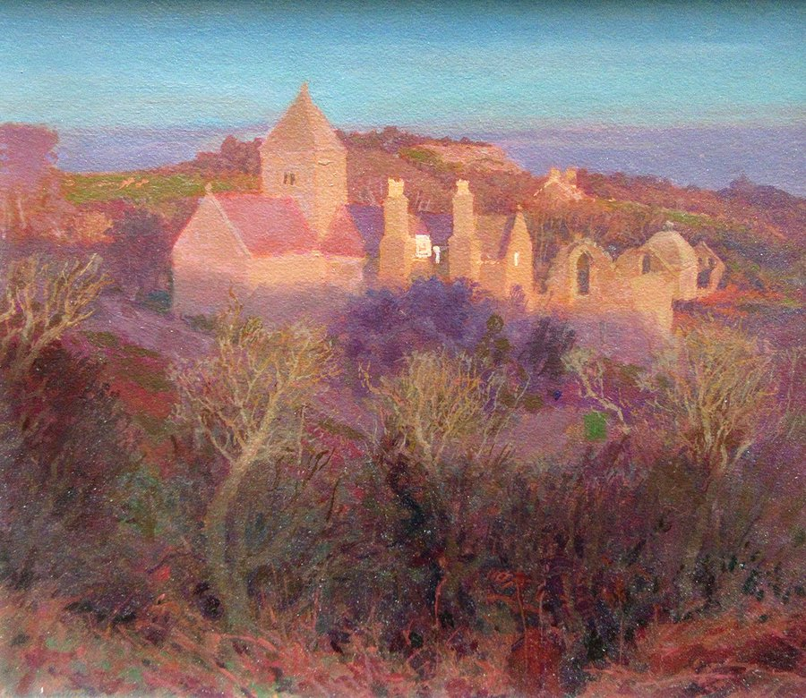
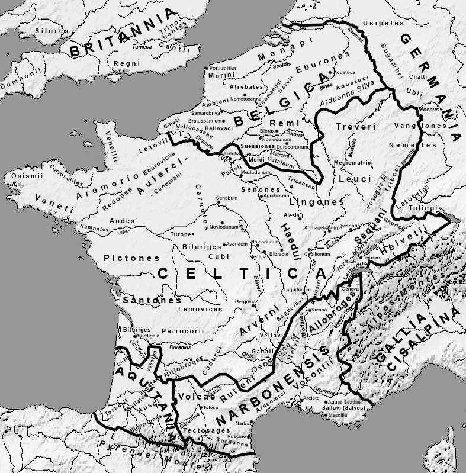

Our sources on the centuries between the retreat of Rome and the High Middle Ages are very scant, often relying on incorrect earlier accounts instead of direct folk memory, or incorrect folk memory instead of written documents, so misconceptions can propagate easily. There is much that we simply can't know. Nonetheless, we have enough to dispel myths and piece together a true story regarding the migrations of the Bretons into Brittany, anciently called Armorica (lit. 'along the sea') which is now politically controlled by France. Since the advent of the Bell Beaker folk into Europe, this peninsula has been populated by Armorican Gauls. In the time of Caesar these tribes included the Osimii, the Venetii, and the Curiosolites[^1]. We can assume that after the Roman conquest, they lived as typical, if rural, Roman subjects. We can assume they sent their druids to meet in Gaul and Britain with other druids of the country.

A popular conception today is that the Bretons originated in Britain, but coming from modern Wales or Central Britain, either as if everyone had shifted westward when the Saxons arrived, pushing people out of Britain and to Brittany, or that the people of Eastern Britain just migrated directly to Brittany after being expelled by the Saxons. This picture is an oversimplification. We do have enough evidence to tell where the Bretons originated, when they migrated, and what were the true causes of their migration.

Procopius, the Byzantine historian, tells us in the 6th century that the people of Armorica had the task of ferrying the souls of the dead to Britain.

>They say, then, that the souls of men who die are always conveyed to this place [the island of Brittia]... Along the coast of the ocean which lies opposite the island of Brittia [i.e. Armorica] there are numerous villages. These are inhabited by men who fish with nets or till the soil or carry on a sea-trade with this island, being in other respects subject to the Franks, but never making them any payment of tribute, that burden having been remitted to them from ancient times on account... And at a late hour of the night they are conscious of a knocking at their doors and hear an indistinct voice calling them together for their task. And they with no hesitation rise from their beds and walk to the shore, not understanding what necessity leads them to do this, but compelled nevertheless. There they see skiffs in readiness with no man at all in them, not their own skiffs, however, but a different kind, in which they embark and lay hold of the oars. And they are aware that the boats are burdened with a large number of passengers and are wet by the waves to the edge of the planks and the oarlocks, having not so much as one finger’s breadth above the water; they themselves, however, see no one, but after rowing a single hour they put in at Brittia. And yet when they make the voyage in their own skiffs, not using sails but rowing, they with difficulty make this passage in a night and a day. Then when they have reached the island and have been relieved of their burden, they depart with all speed, their boats now becomig suddenly light and rising above the waves, for they sink no further in the water than the keel itself.[^2]

When Roman administrators withdrew, Armorica, being on the far west of the continent, was either thrown around by the political machinations of the Gaulish courts, or so isolated that they were unconcerned. By 409 the Armoricans, as Zosimus tell us in his *New History*, 

>The Britons therefore took up arms, and incurred many dangerous enterprises for their own protection, until they had freed their cities from the barbarians who besieged them. In a similar manner, the whole of Armorica, with other provinces of Gaul, delivered themselves by the same means; expelling the Roman magistracies or officers, and erecting a government, such as they pleased, of their own.[^3]

The next year, 410 AD, is when the official retreat of Rome was cemented: Emperor Honorius told the cities of Britain to 'look after themselves.'[^4] Rome was too weak to hold onto either Britain or, it would seem, Armorica. The common narrative is that the Bretons came from central Britain, fleeing from the encroaching Anglo-Saxons; they are essentially Welsh. This idea comes from Gildas (as well as some others, such as Nennius and Eginhard), who said that a portion of Britons fled their island from the Anglo-Saxon invaders.[^5] Gildas' account has the Bretons coming from anywhere between the Midlands of England and Southeast Wales, and fleeing over the sea through Wales, or likely more specifically, from the mouth of the Severn Sea. Sidonius Apollinaris references Bretons settles on the Loire in his *Epistles* in 468 A.D.:

> It was evidently addressed to the King of the Goths, whom it dissuaded from concluding peace with 'the Greek Emperor', urging that instead he should attack the Bretons north of the Loire, and asserting that the law of nations called for a division of Gaul between Visigoth and Burgundian.[^6]

Linguists have shown that the Breton language is most closely related to Cornish, or the Devon dialect of Brytthonic, and that many sentence structures common in ordinary Breton and Cornish only appear in poetical Welsh, indicating linguistic distance.[^7] If the Bretons had come from Central Britain, where the Saxons were taking land, then their language would be closest to Welsh and further from Cornish, which is not the case. They instead must have come from Devon starting around 410 AD, upon the retreat of Rome and the onslaught of the Saxons, or in the decades after.

But are we to believe that the population of Devon, then called *Dumnonii*, fled their lands before the Saxons reached them in the mid-seventh century, and which wasn't fully conquered until the mid-eighth? The fundamental question of the Breton migration is *why* they moved, especially if not forced out by the Saxons. Kenneth Jackson, the linguist cited above, supposes that the migration was begun by migrants to the east of Devon, from the lands that would become Wessex or Mercia, which was merely completed by the Dumnonians with their Cornish dialect, who outnumbered the firstcomers.[^8]

What do we make of Gildas' accounts then? He only states that the aristocrats and military leaders of the Bretons came from Wales, presumably because they had such experience fighting Saxons, that they would be useful against Saxons in Gaul. At the retreat of the Roman Empire from Britain, the island was set upon on all sides by barbarian raids, from the Scots (Irish), Picts, and Saxons. Each was ferocious as the other, enough to be called a "barbarian conspiracy" by Ammianus Marcellinus. I've gone through the extent of the Irish raids before, and how they settled much of West Britain, and especially in the case of the Bretons, the south coast of the Severn Sea.

https://x.com/ogmios/status/1423266247450497028

Some basic background: The Roman Empire had been waning in Britain for years and finally retreated for good in 407 AD. When Rome first conquered Britain, they of course couldn't allow them to retain an independent army, which risked revolt. Rome was their army. When Rome left the Britons were left with their warrior caste carved out of society. Laws had prohibited the natives from bearing arms at all outside of the military. This ban was lifted in 410 AD when Emperor Honorius told the British cities to "look after themselves." Britain was then ruled by local princes, who often petitioned Rome for military aid, begging for help against encroaching invaders. Saxons from the East, Picts from the North, and the Irish from the West, each as vicious as the other.

![[Pasted image 20250201201613.jpg]]

That is no exaggeration. We often play up the power of the Saxon at the expense of the others. Roman writer Ammianus Marcellinus called the raids a "conspiratio barbarica", and the Annals record almost as many Irish and Pictish raids as Saxon ones. Outside Rome, men were wild. The five kingdoms of Ireland (cóiceda) were fighting amongst themselves, but like the Northmen centuries later, internal conflict never deterred expansion. The most Irish-afflicted areas of Britain were the south west of Wales (Pembrokeshire, a.k.a. Dyfed), Cornwall (Dumnonnia), and Argyll (Dál Riata). How extensive were these raids? They were settlements. The ruling dynasty of Dyfed came from Leinster. Many places such as Dyfed or Lleyn were bilingual with Gaelic, at least among the nobility.

![[Pasted image 20250201201649.jpg]]

Many ogham stones from this area (the most in all of Britain) are written in Gaelic, not Brythonic. Many place names in Wales to this day derive from Irish or reference Ireland, such as Llyn Iwerddon, "Lake of Ireland", in Caernarvonshire. Another is Dolwyddelan (Dole-with-eh-lahn), which derives from Gwyddelan and Gwyddel, which is a Welsh term for a Gael or Goidel. Many such terms. A Welsh poet might call another poet's work "diseisnig" and "diwyddelig", that is, untainted by English or Irish. But make no mistake, the Irish in the end left no major genetic impression on the Welsh population. In this instances it was merely a temporary occupation of the upper classes by nobles funded by Irish kings. The raids of the Irish did not begin once the Romans left. It was continuous, and the Romans and Welshmen had constructed defensive forts at Caerleon and Caerwent, and later at Cardiff. A fort at Segontium was used to guard the Roman copper mines on Inis Mona from the Irish.

![[Pasted image 20250201201724.jpg]]

Nonetheless the Irish broke through once Rome left. Cormac's Glossary tells us the following:

>The power of the Irish over Britain was great, and they divided Britain between them into estates... and the Irish lived as much east of the (Celtic) sea as they did in Ireland and their dwellings and their royal fortresses were made there. Hence Dind Tradui... the triple rampart of Crimthann Mór, son of Fidach, king of Ireland and Britain as far as the English Channel... and they were in control for a long time, even after the coming of Patrick.

Now what could that mean, the Irish lived as must east of the sea as west? Perhaps the Britons, like the Picts under the Gaels and the East Britons under Saxons, began to call themselves "Irish", while maintaining a Welsh underground identity. We have to remember that after Britain had been militarily and culturally dominated by Rome, it was easy for barbarians to impress a new culture onto the Britons. The Romano-Britons spoke Latin and wanted to have Roman culture, but this was a one-sided and unstable relationship. The territories of Devon and Lancashire were strongholds against the encroaching Irish powers, stopping the Gael from traveling further inland or northward. The threat of an Adventus Scottorum kept the western kings awake at night. The Severn Sea (modern Bristol Channel) was the stage for major Irish settlement into Devon. Linguistic and historical evidence shows that most of the Britons who fled to Brittany originated in Devon, contrary to Gildas' accounts of Central and Eastern Wales.

![[Pasted image 20250201201848.jpg]]

The traditional narrative of Saxon invaders forcing the Britons of the Welsh Marches across the sea can't be true. The Armorican migration was occurring in the 4th, 5th, and 6th centuries, but Saxon power hadn't reached Wales until the after the Battle of Mount Badon c. 500. Yet the Roman Armoricans had begun allying with and giving land to immigrant Bretons in 409 AD, to bolster their numbers against a continental Saxon scare. The eastern Anglo-Saxons could not have been the cause of the Breton migration, but the western Irish were. The Irish settlements and raids on the Cornish coast of the Severn Sea depopulated the area of its inhabitants. When the Anglo-Saxons reached the area, there were no Celts to retain place names, hence the strange preponderance of English toponymy in Devon. North Wales and Cumbria (Rheged) formed twin kingdoms to repel Irish and Saxon raids. The south called *Deheubarth* meaning "the Right Hand", and the north called *Gwyr y Gogledd* meaning "the Left Hand." These sister peoples often relied heavily on each other for defense.

The Irish settlement of Argyll and the surrounding Isles left a much more distinct genetic and cultural mark. The raiders into Argyll and Galloway established the kingdom of Dál Riata, with its power center at the modern ruins of Dunolly Castle at Oban, and it's monastery at Iona. Before the invasions into Argyll in the 5th century, all of Alba was ruled by Picts and Pictish families. In the East, Picts ruled until the 9th century. The "Picts" (which is a Latin name) likely called themselves *Cruithni*, and spoke a paleo-Indo-European tongue. The conquest of Pictland began when King Fergus Mór and his two brothers led a fleet of 150 men to conquer a number of Western Scottish Isles. They set up their clifftop fortress at the Rock of Dunadd, and expanded eastward from there. The next great King was Aedán Mac Gabráin, who went out to conquer the Orkneys, Hebrides, and all of mainland Scotland as far as Perthshire. These maps don't really show it, but Aedán won a battle in the Orkneys against a Pictish King in 580 AD and won. Dál Riata was powerful.

![[Pasted image 20250201202012.jpg]]

A few generation after the death of Aedán, the Dál Riatic Kingdom was starting to conquer or merge with the Eastern Pictish kingdoms to form the modern kingdom of Scotland. Aedán's immediate successor, Eochaid Buide, was already called *Rex Pictorum*. Irish Gaelic (which would morph into Scots Gaelic) was the language of the royal courts in Pictland, and eventually trickled down to the lower classes, as languages usually do. Folklore also spread from Ireland into Pictland. Scottish folklore today is from the same root as Irish. And although the Ulster Irish kings left a large genetic mark on the western highlands and Galloway, the main expansion of the Irish was political, linguistic, and cultural, adopted by the Picts or Britons from above. Infighting between the Ulaid dynasty within Ulster, along with later Viking maritime power, eventually severed the Scottish Gaels from the Irish Gaels, and Dál Riata was free to focus its attention on uniting Scotland against Vikings and Bernicians.

![[Pasted image 20250201202146.jpg]]

And for some reason, the Irish raiders never had much interest in Rheged. It was left mostly untouched, even in the early days. Though today this area has a strange preponderance of Scandinavian place names instead of Saxon ones. This is because in 902, the Irish Kings repelled the Vikings from Dublin, who then migrated across the sea into Cunbria and Rheged. So there was no difficulty in physically going there, but for some reason the Irish didn't.

Fin

Originally posted on [X](https://x.com/ogmios/status/1429077279200747524).

[^1]: Caesar's *De Bello Gallico*, [Boox II, Chapter 34](https://www.perseus.tufts.edu/hopper/text?doc=Perseus%3Atext%3A1999.02.0001%3Abook%3D2%3Achapter%3D34). *Eodem tempore a P. Crasso, quem cum legione una miserat ad Venetos, Venellos, Osismos, Coriosolitas, Esuvios, Aulercos, Redones, quae sunt maritimae civitates Oceanumque attingunt, certior factus est omnes eas civitates in dicionem potestatemque populi Romani esse redactas.* "At the same time he was informed by P. Crassus, whom he had sent with one legion against the Veneti, the Unelli, the Osismii, the Curiosolitae, the Sesuvii, the Aulerci, and the Rhedones, which are maritime states, and touch upon the [Atlantic] ocean, that all these nations were brought under the dominion and power of the Roman people." Translated by T. Rice Holmes, 1914.

[^2]: From Procopius's [*De Bello*](https://archive.org/details/procopius0000proc_h8x4/page/264/mode/2up), Book VIII, Section XX, 42-58. The full quote is given: "They say, then, that the souls of men who die are always conveyed to this place [the island of Brittia]. And as to the manner in which this is done, I shall presently explain, having many a time heard the people there most earnestly describe it, though I have come to the conclusion that the tales they tell are to be attributed to some power of dreams. Along the coast of the ocean which lies opposite the island of Brittia [i.e. Armorica] there are numerous villages. These are inhabited by men who fish with nets or till the soil or carry on a sea-trade with this island, being in other respects subject to the Franks, but never making them any payment of tribute, that burden having been remitted to them from ancient times on account, as they say, of a certain service, which will here be described by me. / The men of this place say that the conduct of souls is laid upon them in turn. So the men who on the following night must go to do this work relieving others in the service, as soon as darkness comes on, retire to their own houses and sleep, awaiting him who is to assemble them for the enterprise. And at a late hour of the night they are conscious of a knocking at their doors and hear an indistinct voice calling them together for their task. And they with no hesitation rise from their beds and walk to the shore, not understanding what necessity leads them to do this, but compelled nevertheless. There they see skiffs in readiness with no man at all in them, not their own skiffs, however, but a different kind, in which they embark ᾿ and lay hold of the oars. And they are aware that the boats are burdened with a large number of passengers and are wet by the waves to the edge of the planks and the oarlocks, having not so much as one finger’s breadth above the water; they themselves, however, see no one, but after rowing a single hour they put in at Brittia. And yet when they make the voyage in their own skiffs, not using sails but rowing, they with difficulty make this passage in a night and a day. Then when they have reached the island and have been relieved of their burden, they depart with all speed, their boats now becomig suddenly light and rising above the waves, for they sink no further in the water than the keel itself. / And they, for their part, neither see any man either sitting in the boat with them or departing from the boat, but they say that they hear a kind of voice from the island which seems to make announcement to those who take the souls in charge as each name is called of the passengers who have come over with them, telling over the positions of honour which they formerly held and calling out their fathers’ names with their own. And if women also happen to be among those who have been ferried over, they utter the names of the men to whom they were married in life. This, then, is what the men of this country say takes place. But I shall return to the previous narrative."

[^3]: Zosimus' *The New History*, [Book VI](https://en.wikisource.org/wiki/New_History/Book_the_Sixth). The full quote is given: "Constantine being unable to withstand these, the greater part of his army being in Spain, the barbarians beyond the Rhine made such unbounded incursions over every province, as to reduce not only the Britons, but some of the Celtic nations also to the necessity of revolting from the empire, and living no longer under the Roman laws but as they themselves pleased. The Britons therefore took up arms, and incurred many dangerous enterprises for their own protection, until they had freed their cities from the barbarians who besieged them. In a similar manner, the whole of Armorica, with other provinces of Gaul, delivered themselves by the same means; expelling the Roman magistracies or officers, and erecting a government, such as they pleased, of their own."

[^4]: Zosimus, *The New History*, Book VI. "Honorius, having sent letters to the cities of Britain, counselling them to be watchful of their own security, and having rewarded his soldiers with the money sent by Heraclianus, lived with all imaginable ease, since he had acquired the attachment of the soldiers in all places."

[^5]: Gildas' [*On the Ruin of Britain*](https://www.gutenberg.org/cache/epub/1949/pg1949.txt), Chapter 25. "Some therefore, of the miserable remnant, being taken in the mountains, were murdered in great numbers; others, constrained by famine, came and yielded themselves to be slaves for ever to their foes, running the risk of being instantly slain, which truly was the greatest favour that could be offered them: **some others passed beyond the seas with loud lamentations instead of the voice of exhortation.**"

[^6]: Sidonius Apollinaris' *Letters* or *Epistels*, Book I Letter VII, here translated by Ormonde Maddock Dalton in 1915. 

[^7]: Kenneth Jackson's *Language and History in Early Britain: a Chronological Survey  of the Brittonic Languages 1st to 12th c. A.D.*, by the Four Courts Press 1994. The relevant passage on Breton migrations from pg. 11-30. A full quote from pg. 16: "But the linguistic and other evidence already mentioned would appear to show that [the Bretons] must have come from the Devon-Cornwall peninsula, if not also from the nieghboring districts to the east." Jackson also lists ample manuscript evidence for the timing and location of the Breton migration.

[^8]: Ibid. pg. 25-26.