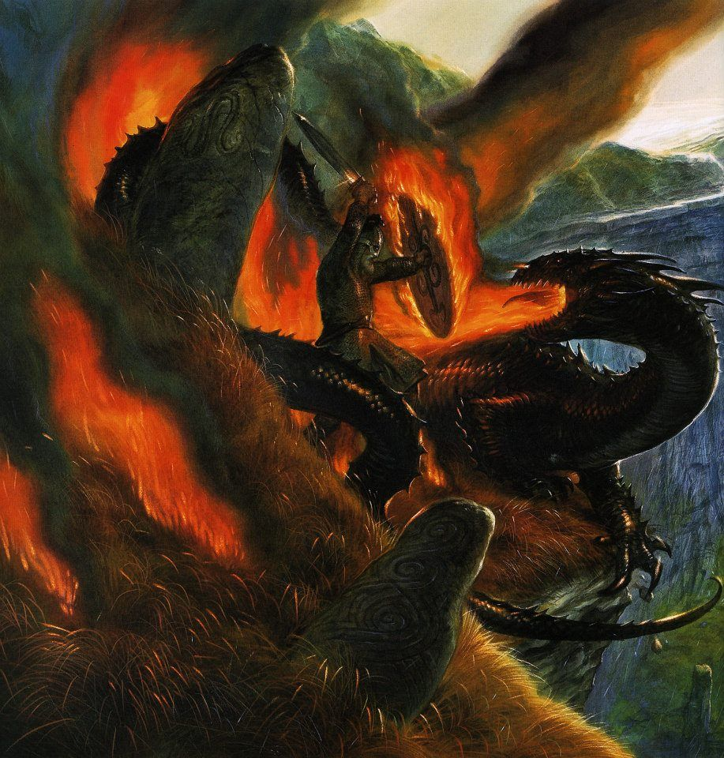
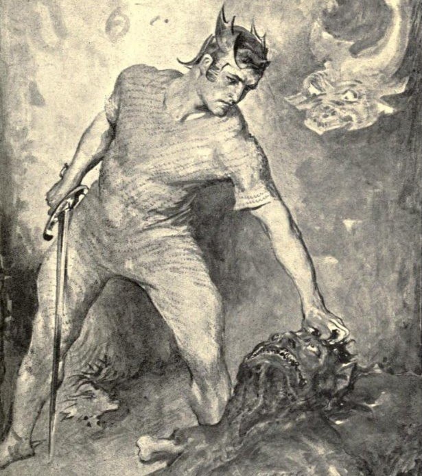
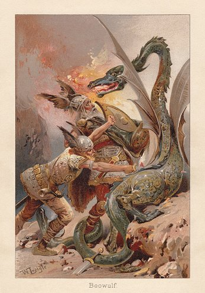
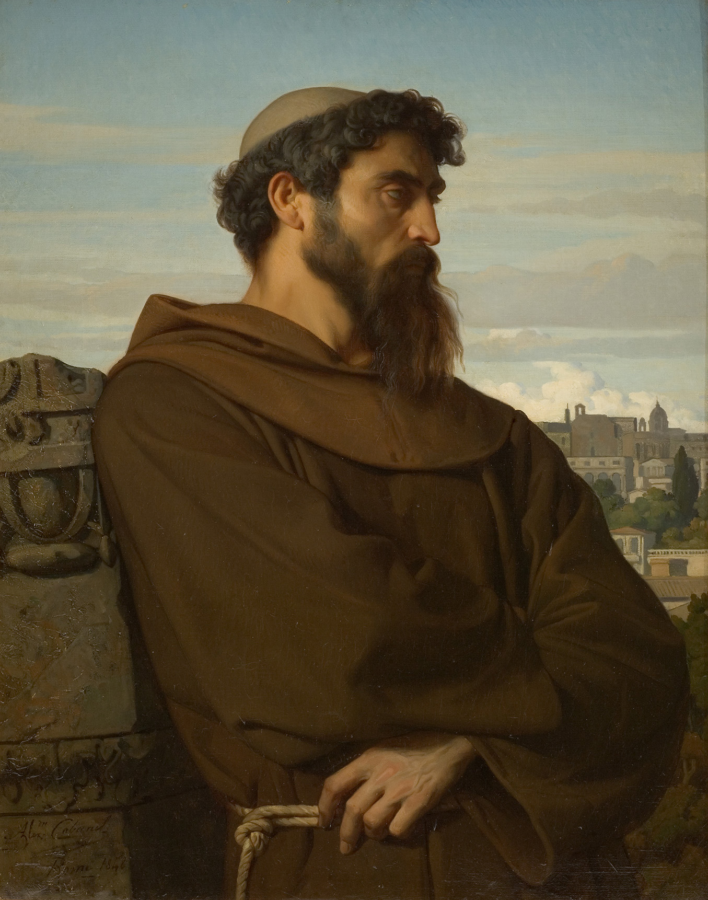

Beowulf is, of course, the primeval myth of the Anglo-Saxons. It takes place in Denmark, but it may have a broader North European origin. But it has little-known similarities to the Irish saga known as the *Táin Bó Fraích*.

The *Beowulf* story is set in Scandinavia in the 6th century AD, but the manuscript its written on was produced around the year 1000 AD. It's still contentious how old the story really is, when it was first recorded, and whether it was originally an oral tale or a written composition. *Beowulf* is also an extremely strange story. It is thematically and imagistically Germanic pagan, but the story is Christian, which has led some scholars to conclude it was not a *scop* who wrote the story, but a monk in a monastery. *Beowulf* also seems original in the world of Germanic sagas, it is unlike any other story. Who is Grendel, why does Beowulf wrestle him naked and tear his arm off? Why fight Grendel's mother underwater? How does the dragonslaying episode at the end fit in?

A recap of Beowulf and a comparison to the *Táin Bó Fraích*: Beowulf appears from far away, and a watchman remarks: "Never have I seen a greater noble warrior upon the earth, than that one of your number, a man in his war-weaving". In the Irish saga, Fraech and his retinue of the *Síde* mound are spotted from afar:

>The watchman sees them from the dun when they had come into the plain of Cruachan. "A multitude I see," he says, "(come) towards the dun in their numbers. Since Ailill and Maev assumed sovereignty there came not to them before, and there shall not come to them, a multitude, which is more beautiful, or which is more splendid."

Beowulf approaches Hrothgar's hall and is greeted by a herald before meeting the Earl. The herald returns with permission to enter the hall and feast. In the *Táin*, Fraech sits outside *Dún Chrúachan* until he is received by a retainer, who eventually grants him the King's welcome.

>They alight in front of the dun. They tent their steeds, and they loose the chase-hounds.... A message comes from the king for a parley with them. It is asked whence they came, they name themselves according to their true names, "Fraech, son of Idath this," say they. The steward tells it to the king and queen. "Welcome to them," say Ailill and Medb; "It is a noble youth who is there," says Ailill, "let him come into the Liss (outer court)." The fourth of the house is allotted to them.

Inside, the warriors feast and are served by the queen out of a jeweled cup. Someone relates the hero's skill at swimming. The Grendel episode is unique to Beowulf, but the fight against Grendel's mother overlaps.

In *Beowulf*, he dives into the dark pool, and swims downward until the water monster, Grendel's mother, grabs him by the side. He wrestles at first, before finding a sword in her lair and beheading her with it. He beheads Grendel's body as well, and carries the head back to land. In the *Táin*, Fraech is swimming in a black lake as Aillil and Medb look on when he is attacked by a water beast, who grabs him by the side. He wrestles the monster, before crying out for a sword from the crowd watching him. Aillil's daughter Findabair swims out to him with a sword. Fraech beheads the monster, and carries its head back to land.

There is a final episode in both tales far away from their previous settings, when Beowulf kills a dragon and Fraech battles a serpent, each with the help of a single companion, Wiglaf and Conall Cernach respectively.

<!--  -->

There are numerous other smaller similarities you could find in your reading of both. And yet the stories don't align exactly either. Beowulf appears to fight Grendel, Fraech appears to woo the princess Findabair. There is no cognate of Grendel in the *Táin Bó Fráech*. Beowulf has a personal history of great deeds which is not shared by Fraech in this tale. Hrothgar is attacked by Grendel and his mother, while Fraech's monster is a trap laid by Aillil and Medb to stop him from eloping with the princess.

The stories have many differences, but we still cannot deny that many images and themes are the same in both, beyond what is reasonable for two unrelated legends. Is this Irish influence in Anglo-Saxon society? Some academics have tried to "monasticize" Beowulf, because if it could be proved that Beowulf was written in a monastery, we could conclude that the Táin Bó Fráech was used as a model for Beowulf. We could imagine some young Anglo-Saxon monk studying under his Irish peers and learning their legends, perhaps learning Gaelic, and craving to see his own race represented in such a heroic light.

<!--  -->

I don't believe this monastic theory. Academics debate it because there's positive evidence from this period, and academics hate speculation. There is equal evidence in support of an North European dragon slaying hero myth, represented in Beowulf, Fraech, Siegfried, and ultimately Apollo. We could easily say that Fraech and Beowulf are relfexes of popular gods, like Apollo slaying Python. Aillil and Medb are quite clearly the solar and lunar deities of the Irish pantheon. But Beowulf is tied to non-mythical history. The characters and clans named there are real. The characters in Beowulf tie him to 6th century Scandinavia. Now we must ask, how much of Beowulf is myth? Was Beowulf a real person who had a myth applied over his life story? Was Grendel real? Or was this originally a myth that was laid on top of the local geography? Many Irish stories which purport to be historical share extreme similarities with the myths of other cultures. Likely among Northern Europeans, myth and history were united. After all, the post-Classical idea of a "myth" as something separate from history is certainly not native. But these are questions which neither I nor scholars can answer. If any of you have ideas on this, please share, and if any of you do some reading and find some detail which sheds light on our ancient stories, share that as well.

Fin.