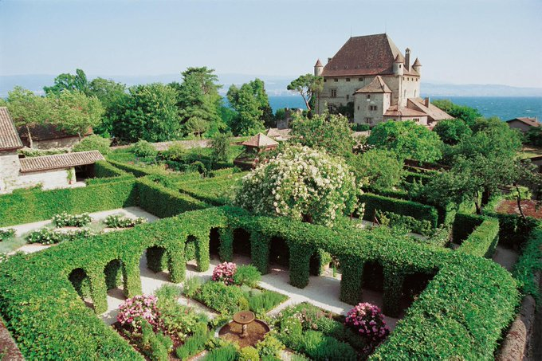
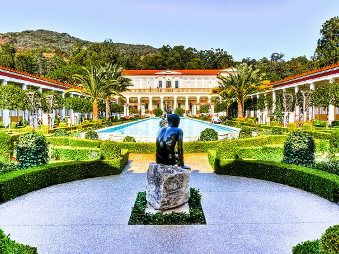
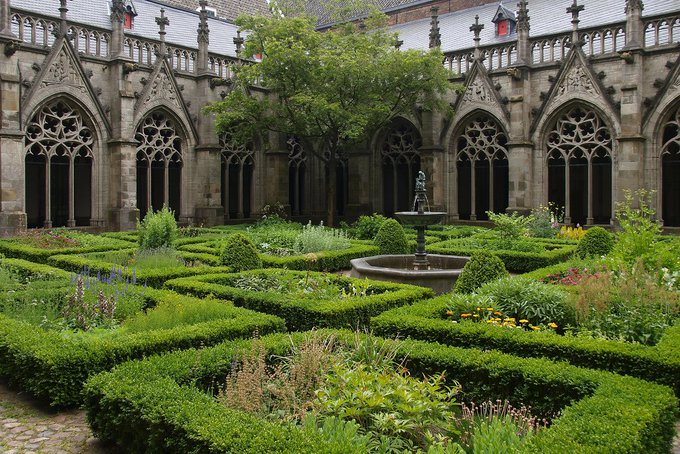
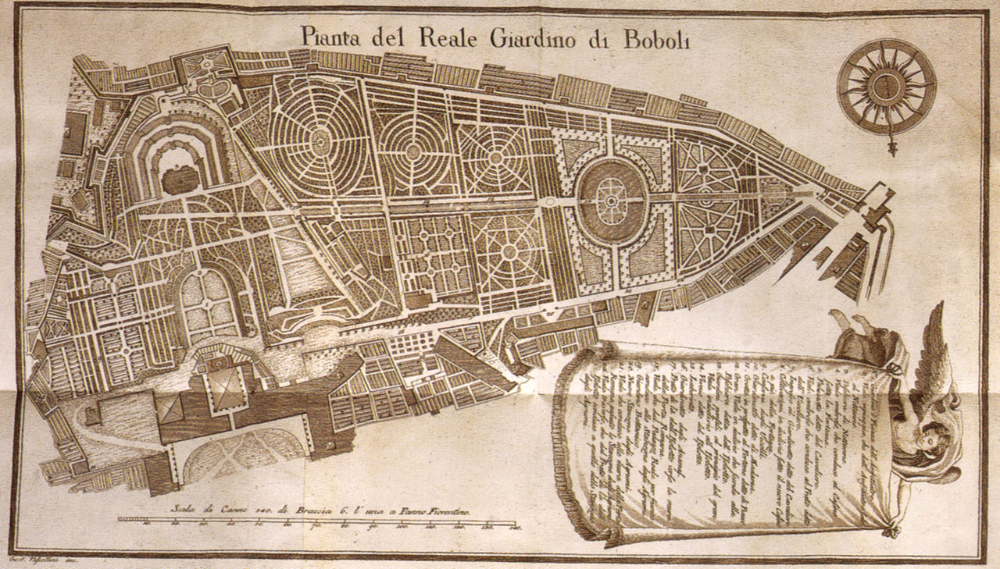
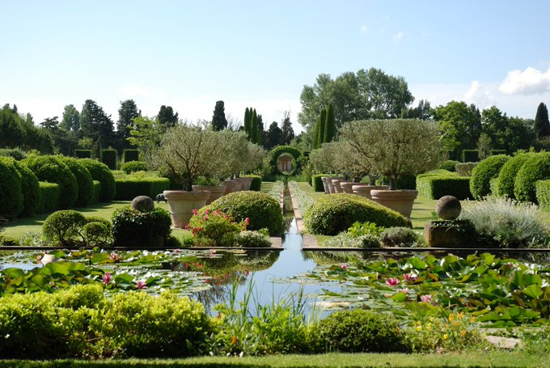
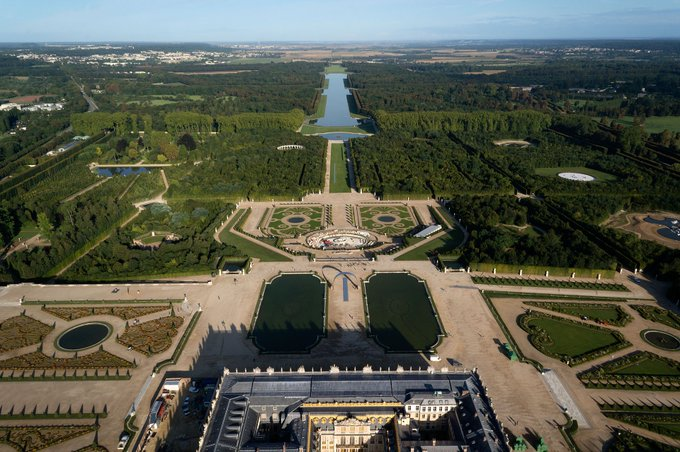
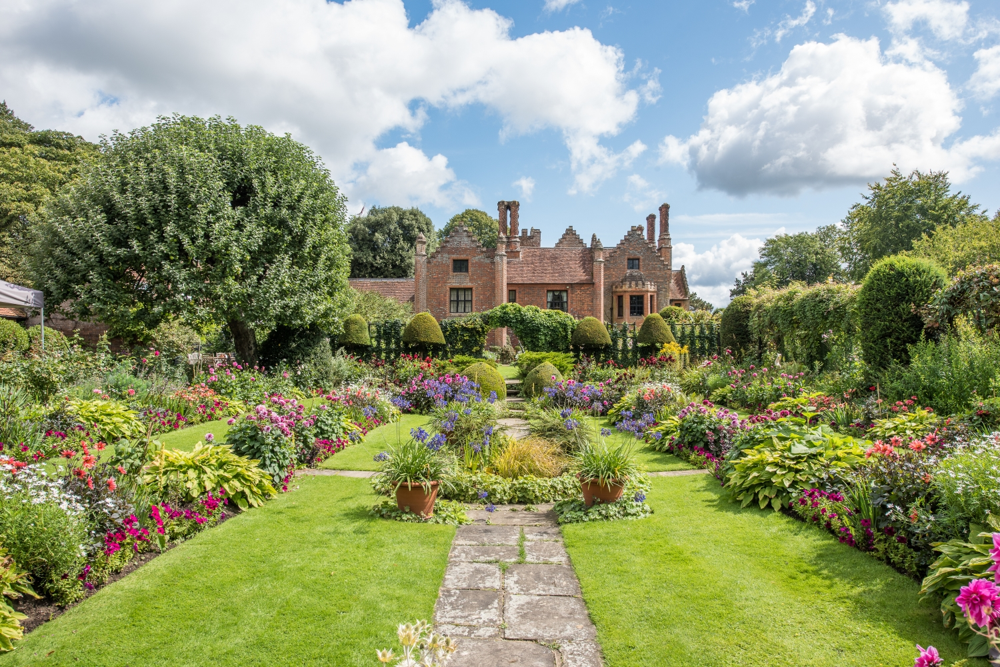
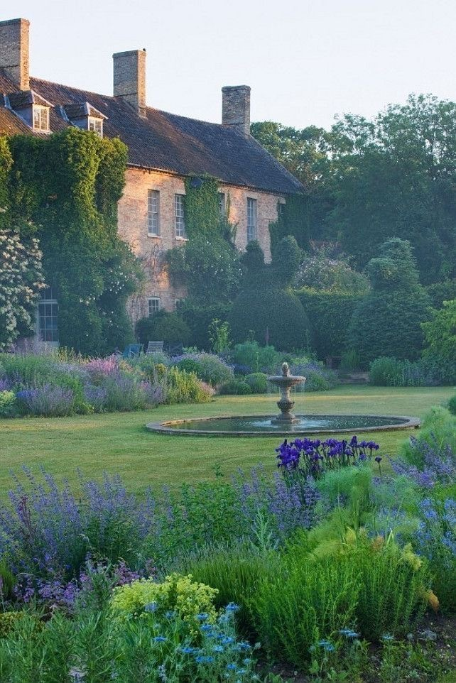
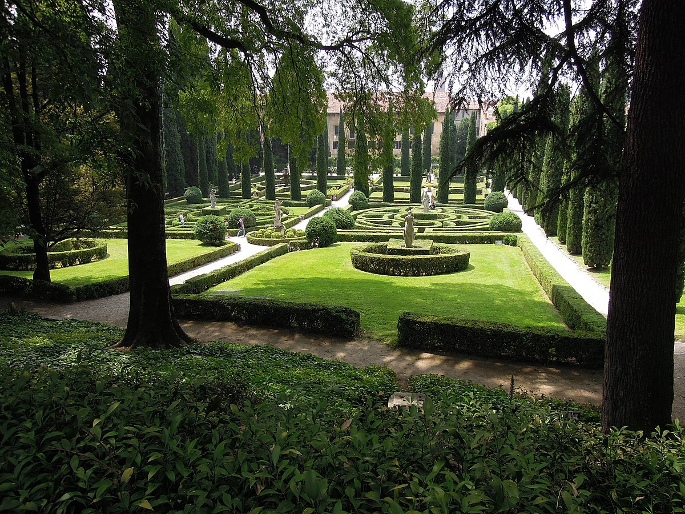
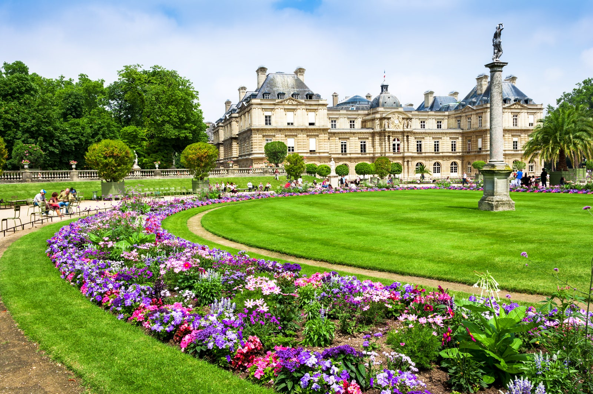

A post on gardens. The eternal repose of the aristocratic soul, his garden, it can be done very well or very poorly. Some are outright terrible. They are a deep European tradition, archetypal (Eden, Hersperides, Gethsemane, Elysium). The contrast between the controlled nature inside the garden walls and the wild nature outside called back to the garden at Humanity's beginning.

French gardens are the most well known globally, for good reason. The Frenchmen had just about perfected the art. The formula: a medieval château encircled by cultivated greenery. The *jardin á la française* as a style developed from the earlier Italian Renaissance garden. This Italian style began with walled urban gardens used to grow specific herbs, flowers, and vegetables like grapes for wine. As the Renaissance began and Classical ideas drifted through the air, people picked up tomes of Pliny, Varro, and Ovid, who reminded then of the **splendor** and **glory** of the gardens surrounding Roman Villas. The Renaissance Italians desperately wanted to revive this style, to resurrect a piece of Rome's legacy. They developed these walled gardens as well as open ones, geometrically planned and filled with beautiful decoration.

But the Italians didn't draw solely from Rome, and a garden is not simply a place to store plants and art. Medieval monks had cultivated the practice of gardening in their monasteries. Monks **demanded** order and peace for silent meditation and effective prayer to God. This ideal of a garden, both splendorous and tranquil, both sprawling and controlled, is the impetus for the aristocratic adoption of the art of gardening in Europe and now in all the world. Taken from the glory of Rome and the dedication of Christian monks. Outside the city walls was dangerous nature: brutal, elemental, and obeying the law of the jungle. Inside Man's garden, nature was controlled, shepherded, and led towards perfection, as in Eden. The garden planner imitated the Lord, ordering the world from disarray.

To do this, gardeners often made use of mathematics to appeal to the human senses. Their gardens were planned with geometric forms and placed high above the city by his villa. Nature bounded by mathematical order.

At times the geometry could be too much and begin to stifle the natural beauty of the garden plants.

But not all gardens developed in this rigid way. Often it was simply a walled or restricted area where rare trees could grow, flowers bloom, a place for walking and contemplating. This is the incredibly large garden at *Château dela Reine*.

These styles were quickly adopted in France, as when King Charles VIII found them in Napoli. Every French aristocrat soon dreamt the dream of Nature cultivated by Man. To that end, the French did not keep their gardens strictly walled, but imposed order on larger sweeps of land. The French loved to impose geometry on their gardens. And the garden as a whole was an ambulatory for the King or Nobleman, to clear his mind and refresh his spirit. The French aim: to cultivate those qualities in men which led to the power of Rome, of Medieval Christendom, and to the power of France; to be overcome with Nature, to learn from it; to sharpen himself on Nature, to master it, and to rule it lovingly.

The gardens at Versaille are the most renowned. They entertained hundreds of guests on a daily basis after King Louis XIV moved his court there. But this is where gardens can suffer under their own weight. The overly mathematical nature of many gardens of the French style can prevent the very goal they set out to achieve. Nature cannot exist in strictly geometrical forms, neatly trimmed, the landscape has its own features which accentuate its beauty and which the garden should emphasize. When the straight path cuts through the trees, however, any natural features are disregarded in favor of hueman convenience or sloth. This is one feature that the English country garden avoids. When designs become overly mathematical, some can have more sinister meanings.

The English, naturally, adopted the art of gardening in turn. Unlike the Italian garden of potted plants and marble statues, or the French garden of numerical purity and direct walking paths, the English garden appears as an overgrown flower bed, a home for insects and plants. This tight infilling of beautiful flora is balanced by the wide area of cut lawn. It gives the aristocratic man a place to walk, a place to run or ride horseback, a place to admire Nature's flourishing, and a place to meditate surrounded by life. Of all the garden traditions so far, this one appears the most vitalist, almost overrun with life, yet tranquil. One could spend all day in leisure in the English garden, both controlled and wild, thinking, meditating, watching the birds or butterflies before reentering the world of struggle and fight.

This style of lawns which stretch for miles in the English Country Garden. It spread to many places, especially in Germany, and is iconic to the English manor house. But even if the English garden isn't enjoyed by Man, its focus on Nature above marble statuary or geometry means that it is at all times appreciated by Harmony itself. It needs no inhabitant to be beautiful.

It goes to show the popularity of these gardens that even men of modest means apportioned their property to these purposes. You didn't need an estate house to plant flowers in the yard.

The largest estates, however, often mixed the worst of the French and English styles, setting out endless mowed lawns alongside neatly trimmed bushes. Nowhere for life to thrive, purely decorative and meant only to be seen from afar from the windows of the manor house. I like this style very little.

A demonstration of the different tastes of the Italian, French, and English nations.

Fin.

---

Originally posted on [X](https://x.com/ogmios/status/1545161171107545088).