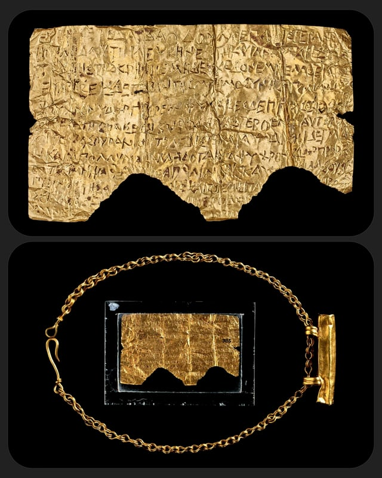
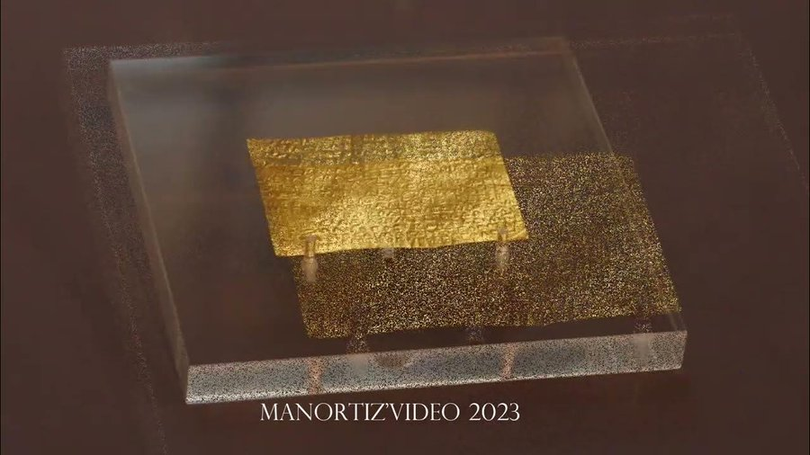
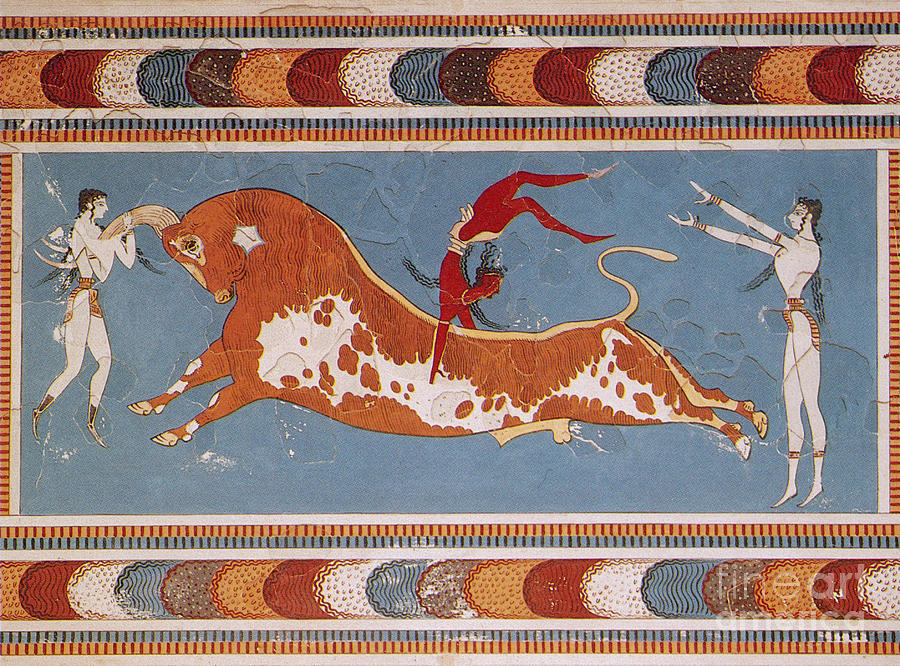

A post on the appearance of milk in the Orphic Grave Tablets.

Milk is used as a symbol of immortality, which an Orphic initiate attains after death through specific ritual. Numerous grave tablets have this analogy. Firstly, the Orphic grave tablets are a series of Greek inscriptions on gold tablets deposited in tombs, most often in Magna Grecia (South Italy). The greatest is the Petelia Tablet, seen here, which was rolled up inside a gold cylinder on a chain. Tablet is c. 300 BC, while the case is c. 100 AD.

Here you can see its Greek and next to it my translation. This is a rare tablet that does *not* mention milk, but which is the most famous and goes to show the kind of content we're considering. After death the initiate is to find the Lake of Mnemosyne (Memory) and drink from it.


Ancient Greek
Εὑρήσσειϛ δ’ Ἀίδαο δόμων ἐπ ἀριστερὰ κρήνην,
πὰρ δ’ αὐτῆι λευκὴν ἑστηκυῖαν κυπάρισσον·
ταύτηϛ τῆϛ κρήνηϛ μηδὲ σχεδὸν ἐμπελάσειαϛ.
εὑρήσειϛ δ’ ἑτέραν, τῆϛ Μνημοσύνηϛ ἀπὸ λίμνηϛ
ψυχρὸν ὕδωρ προρέον· φύλακεϛ δ’ ἐπίπροσθεν ἔασιν.
εἰπεῖν· Γῆϛ παῖϛ εἰμι καὶ Οὐρανοῦ ἀστερόεντοϛ,
αὐτὰρ ἐμοὶ γένοϛ οὐράνιον· τόδε δ’ ἴστε καὶ αὐτοί.
δίψηι δ’ εἰμὶ αὔη καὶ ἀπόλλυμαι. ἀλλὰ δότ’ αἶψα
ψυχρὸν ὕδωρ προρέον τῆϛ Μνημοσύνηϛ ἀπὸ λίμνηϛ.’
καὐτοί σοι δώσουσι πιεῖν θείηϛ ἀπὸ κρήνηϛ,
καὶ τότ ἔπειτα τέλη σὺ μεθ’ ἡρώεσσιν ἀνάξειϛ.
Μνημοσύνης τόδε ... ... ... θανεῖσθαι ...
... τόδε γραψ ... ... τογλωσειπα σκότοϛ ἀμφικαλύψαϛ.
-&-
English
You will find to the left of Hades' halls a spring,
And beside it a shining cypress standing.
You will not come near to this spring.
You will find another, from the Lake of Memory,
cold water flowing. Guards are stationed before it.
Say: "I am a child of Earth and starry Heaven,
and my race is of heaven. You yourselves know this.
I am parched to thirst and dying. Give me, quickly,
the cold water flowing from the Lake of Memory."
And they will give you to drink of the divine spring,
and then afterwards among the heroes you will have lordship.
... of Memory ... ... ... to die ... 
... that is written ... ... darkness envelopes.


After this the initiate will join the immortal heroes. Here is another one and my translation. This is a composition of the three Thurii Tablets A1-3 with almost identical texts; I have combined them in a way that seems most appropriate to me.


Ancient Greek
Ἔρχομαι ἐκ καθαρῶν καθαρά, χθονίων βασίλεια,
Εὖκλε καὶ Εὐβουλεῦ τε καὶ θεοὶ ευδαίμονες ἄλλοι·
καὶ γὰρ ἐγὼν ὑμῶν γένος εὔχομαι ὄλβιον εἶναι
ποινὰν δ’ ἀνταπέτεισ’ αντ ἔργων οὔτι δικαίων.
εἴτε με Μοῖρα ἐδάμασσε καὶ αθανατοι θεοι αλλοι
βροντε τ’ ἀστεροπε τε και αιθαλοεντι κεραυνῶ.
Κύκλου δ’ εξεπταν βαρυπενθοες αργαλεοιο
’Ιμερτόν δ’ επεβαν στεφανον ποσι καρπαλιμοισι
Δεσποινας δ’ ύπο κολπον εδυν χθονιας βασιλειασ.
Νυν δ’ ικετης αγνην ηκω παρα Φερσεφονειαν
’Ως με προφρων πεμψη εδρας ες τας μακαριστας εὐαγέων
’Ολβιε και μακαριστε, θεος δέση άντι
βροτοιο εριφοσ ες γαλ’ επετον.
-&-
English
I come pure from the pure, Queen of the Underworld,
Eukles, Euboleus, gods and other good spirits,
for indeed of your blessed race I claim to be.
You have repaid unrighteous deeds with punishments.
either Fate subdued me, or the other deathless gods, or the Thunderer throwing his thunderbolt.
I flew out of the bitter grief-stricken circle,
to the desired crown I came with swift feet,
I went down under the bosom of the Lady,
Queen of the Underworld.
Now a supplicant I have come beside pure Persephone
so that, in kindness, she will send me to the seats of the most blessed pious ones.
Happy and most blessed, a god you shall be instead of a mortal.
A kid goat flying into milk.
 

Notice the last line, "a kid (goat) flying/rushing into milk," immediately after becoming a Θεός. An allegory for apotheosis, in which the young goat is submerged in that which he craves most, in the same way the initiate entering the halls of the heroes is plunged into bliss.

Here is my translation of a third tablet from Thurii, Italy, known as A4. We once again see the formulation of a kid goat falling or rushing into milk immediately after the initiate has become a god, Θεός.


Ancient Greek
Ἀλλ’ ὁπόταν ψυχὴ προλίπηι φάος ἀελίοιο,
δεξιὸν εννοιας δει τινα πεφυλαγμένον εὖ μάλα πάντα·
χαῖρε παθὼν τὸ πάθημα τὸδ’ οὔπω πρόσθε ἐπεπόνθεις·
θεὸς ει ελεεινού έξ άνθρόπου. ἔριφος ἐς γάλα ἔπετες.
χαῖρε χαῖρε· δεξιὰν ὁδοιπορών
λειμῶνάς τε ἱεροὺς κατ’ ἄλσεα Φερσεφονείας.
-&-
English
Whenever the soul might leave behind the light of the Sun,
travel to the right, being well guarded in every way.
Hail, you who has experienced this experience, which you had not experienced before.
A god has been gained from a man. A young goat falling into milk.
Hail, hail. Journey to the right through
the holy meadows and groves of Persephone.


And a fourth from Pelinna, Thessaly, Greece. Here you see it most strongly, because it's repeated three times (almost as if reflecting the thrice-blessed τρισολβιε appellation).


Ancient Greek
νῦν ἔθανες καὶ νῦν ἐγένου, τρισόλβιε, ἄματι τῶιδε.
εἰπεῖν Φερσεφόναι σ’ ὅτι Βάκχιος αὐτὸς ἔλυσε.
ταιῦρος εἰς γάλα ἔθορες.
αἶψα εἰς γάλα ἔθορες.
κριὸς εἰς γάλα ἔπεσες.
οἶνον ἔχεις εὐδαίμονα τιμὴν
καὶ σὺ μὲν εἶς ὑπὸ γῆν τελέσας ἅπερ ὄλβιοι ἄλλοι
-&-
English
Now you have died and you have been born, thrice-blessed, on this very day.
Tell Persephone that Bacchus himself freed you.
A bull into milk, you leapt.
Quickly into milk, you sprang.
A ram into milk, you fell.
You have wine as a fortunate honor
and you, indeed, will go under the earth, having been consecrated
as the other blessed ones.


So why milk? The simplest anthropological reading is that milk is something a kid (goat) craves, so falling into (an ocean of) milk represents the good afterlife, one where all the things which we sought in the  material world are supplied in abundance. This imagery would make sense to a pastoral people. This summing up all of Orphic initiation into a single symbolic phrase is called a *synthema*, and would serve to remind the initiate that all his trainings are what earn him immortality or knowledge of his true self. But the verb "rushing or leaping" (*εθορες*, *επεσες*) could also imply a ritualistic action or dance performed before death. We see this in other Greek cults, as when Cretan youths imitated the dance of the *Kouretes*, or when "rushing" Maenads celebrate the coming of Dionysus.

Milk in Greece, as in all Aryan societies, was connected intimately with the stars and therefore Heaven & the gods. The word for milk, *γάλα* "gala", seemed to converge with celestial words, like the Milky Way galaxy, known as *γάλακτος* *κύκλος* "milky wheel", *γαλαχιος* "galaxios", or even *το γάλα* "the milk". The Milky Way was the Road of Souls to the afterlife, possibly what Pindar called "Zeus's Way" in Olympian 2. Souls would also descend from the abode of the blessed gods to incarnate, thus explaining why babies needed to drink specifically milk from their mothers. There were many beliefs that souls became stars once in Heaven, as in this Arkesine inscription "Mother, do not weep for me. What is the use? You ought rather to reverence me, for I have become an evening star, among the gods." So then our milk seems to be a stand-in for Heaven, or that the HEavens were observably full of milk. And when the tablets say *εις γάλα εθορες*, it may not mean "you rushed into milk", but "you rushed into the galaxy (i.e. Heaven & the gods)".

Milk was symbolic of the end of life for blessed heroes and initiates, and of the beginning of life for newborn babies. Thus it probably represented a cycle of rebirth, or at least incarnation. The wicked are deprived of milk in Hades or Tartaros. Is this idea Indo-European? We see an identical conflation in Ireland, where the Irish name of the Milky Way is the "Bealach ná Bó Finne" or "Way of the White Cow"; Vedic Aryans called it, among other names, "devapatha" or "god path". In each, the souls of dead heroes walk it. The primordial milk-giving cow in Gylfaginning supports the life of Ymir, and perhaps the Norse thought it was her milk which spilled across Heaven to form the Milky Way. In Irish we seem to have a heavenly cow as well in the Bó Firinne.

The connection between milk and the white galaxy overhead is strong, as is the conception of that region of the sky being the home of the gods. These are the double-meanings which Greek Orphic initiates understood when going through their trainings. For the initiate, his recollection of his "true self" would earn him entry into the abode of the gods and heroes, and so would literally enter the milk above, and fall into a milk which is desirable and pleasant. Since his enlightened state is due to his initiation, we could even say that his initiation on Earth is an early development of his enlightened state in Heaven, and so his initiation is the milk he seeks. And the initiate would be the young goat, inexperienced and even clumsy, who needs spiritual sustenance (i.e. Orphic wisdom).

So, the milk formulae in these tablets appear to be synthemata meant to remind the initiate of the culmination of his Orphic training, and simultaneously of the immense pleasures of Heaven and the gods after death, just as we take pleasure from drinking fresh milk on Earth.

That's my broad, surface level theory, anyway.
Fin.

Originally posted to [X](https://x.com/ogmios/status/1791827998733214118).