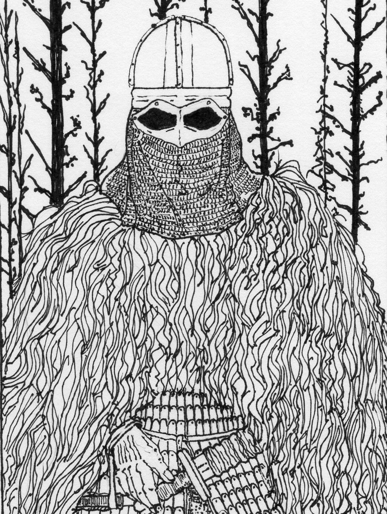
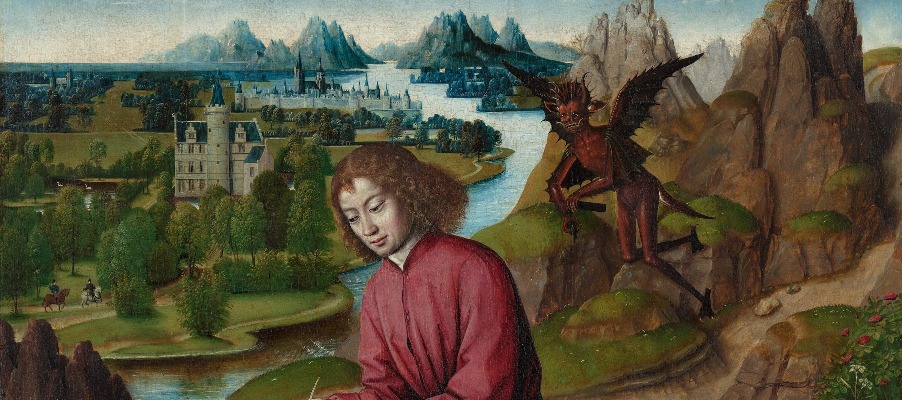
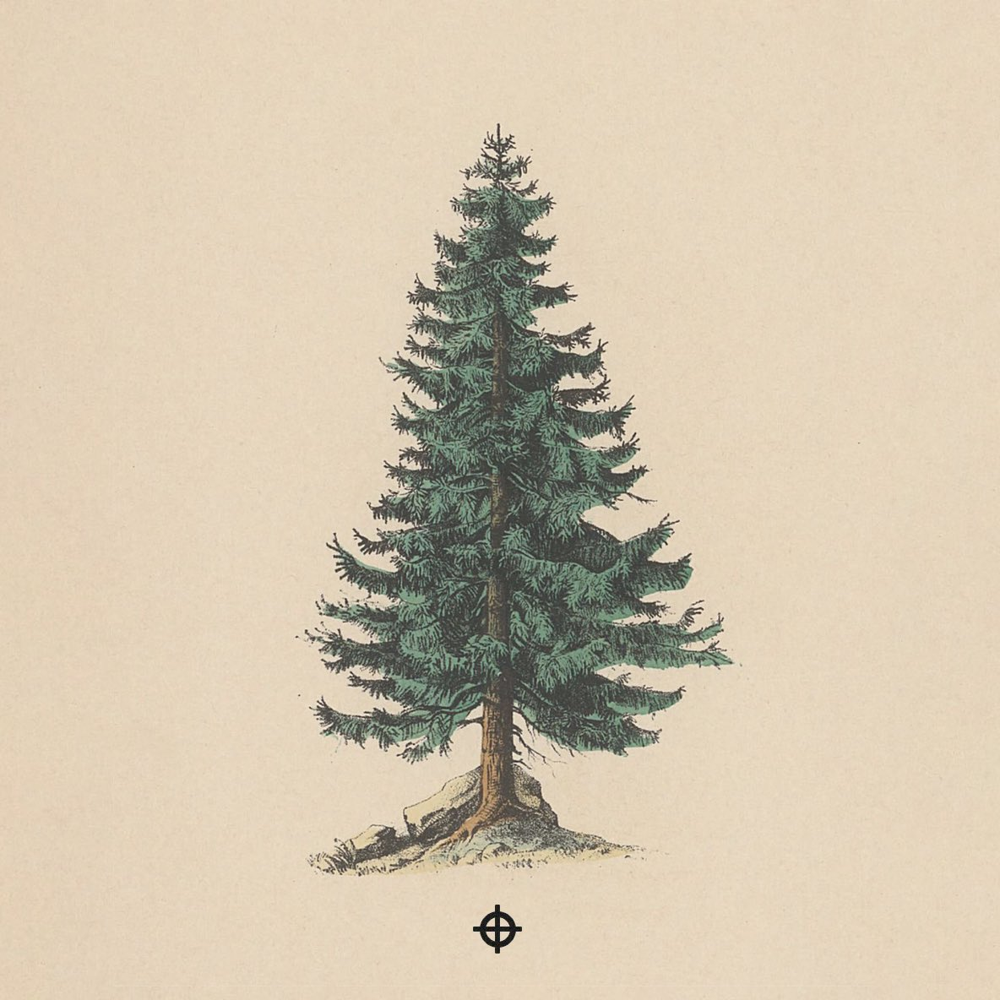
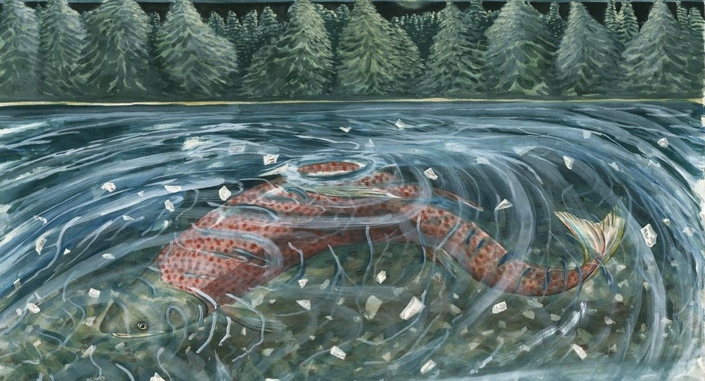
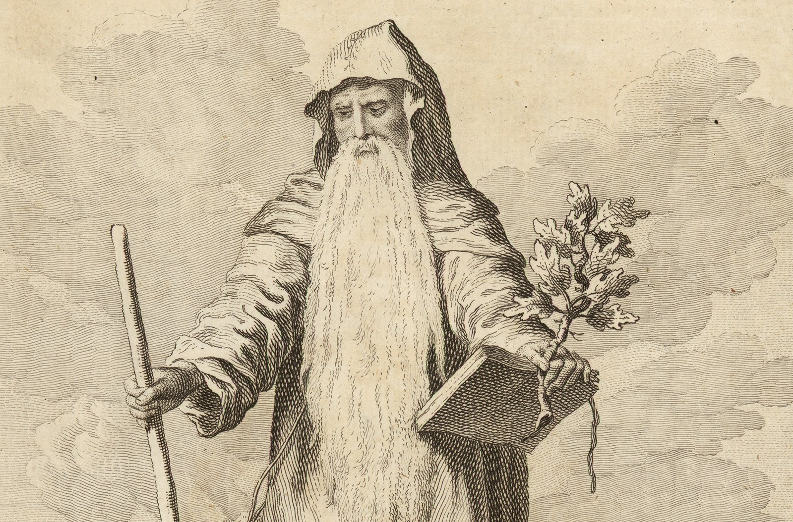

My reading of the Anglo-Saxon Nine Herbs Charm or 𝘕𝘪𝘨𝘰𝘯 𝘞𝘺𝘳𝘵𝘢 𝘎𝘢𝘭𝘥𝘰𝘳, which is one of the few Anglo-Saxon magical and medical texts that survives. It brings Woden and Christ into the same text, among many other esoteric passages. The Nine Herbs Charm was translated by Oswald Cockayne in 1866, seen [here](https://archive.org/details/leechdomswortcun03cock/page/30/mode/2up), and recently by Joseph Hopkins for mimmisbrunnr.info in 2020, seen [here](https://www.mimisbrunnr.info/nigon-wyrta-galdor), and there are a few contentious points that people disagree on.

## Herbs and Disease

Many of you will be interested in Woden, the glory-twigs, and the seven worlds, but this is foremost a medicinal text. The nine herbs are:

𝘔𝘶𝘤𝘨𝘸𝘺𝘳𝘵 - Mugwort
𝘞𝘦𝘨𝘣𝘳𝘢𝘥𝘦 "Waybread" - Plantain
𝘚𝘵𝘶𝘯𝘦 - Lamb's Cress
𝘈𝘵𝘵𝘰𝘳𝘭𝘢ð𝘦 - Fumitory
𝘔æ𝘨ðe - Chamomile
𝘞𝘦𝘳𝘨𝘶𝘭𝘶 - Nettle
Æ𝘱𝘱𝘦𝘭 - Crab Apple
𝘍𝘪𝘭𝘭𝘦 - Chervil
𝘍𝘪𝘯𝘶𝘭𝘦 - Fennel

The text names the plant and sings the virtues of each, but the plant list is debated since the poem is unclear, some names may not be names. And in the prose section after the poem, the author changes the nine herbs: *stune* becomes lambscress, *wergulu* becomes nettle. But we know there are nine since in the prose he says there are 𝘯𝘺𝘨𝘰𝘯 𝘸𝘺𝘳𝘵𝘢, nine worts, which prevail against the nine venoms and nine "flying vile things". The herbs are conceived of as nine types of soldier, warriors of the plant world, which war against poison, and which were placed in the world by the Lord (Christ or Woden). This warband of plants is led by the heavenly Lord.

Poison and disease are thought of as invisible serpents that writhe across the land, or swarms of flies in the air. They are called "loathful ones", 𝘸𝘺𝘳𝘮.



þu miht ƿiþ attre
⁊ ƿið onflyge
þu miht ƿiþ þa laþan
ðe geond lond færð
 
For venom availest,
For flying vile things;
Mighty against loathed ones
That through the land rove.



Each herb has some inner strength that destroys or nullifies the venom of these malevolent spirits which wreak disease, if prepared the right way. Here it instructs the reciter to make a salve of the herbs, fennel, ashes, water, and egg, then to bathe the wound in it.



Mugwort, waybroad which spreadeth open towards the east, lambscress, attorlothe, maythen, nettle, crab apple, chervil, fennel, and old soap; work the worts to a dust, mingle with the soap and with the verjuice of the apple; form a slop of water and of ashes, take fennel, boil it in the slop, and foment with egg mixture, when the man puts on the salve, either before or after. Sing the charm upon each of the worts; thrice before "he" works them up, and over the apple in like manner; and sing into the mans mouth and into both his ears the same magic song, and into the wound, before he applies the salve.



This is ancient herb-medicine. In Ireland at around this time (10th century), doctors had divided medicine into herb-medicine (pharmacology), knife-medicine (surgery), and song-medicine (prayer/chanting), which were the three methods available to ancient doctors: chemical intervention, surgical intervention, or lifestyle change. This entire charm is meant to be sung, hence why we call it the nine herbs 𝘨𝘢𝘭𝘥𝘰𝘳 or song. In fact, in the previous excerpt, we are specifically instructed to sing this charm to the herbs, and into the victim's mouth and ears, and into the wound.

Disease was seen as something which lingers high in the air, in cold, wet places, or within animals and plants which hate mankind, caused by malevolent spirits and which overtake people suddenly. A sickness must be weakened, then banished. Here, venom is something to be "blown away".



Motan ealle weoda nu ƿyrtum aspringan
sæs toslupan, eal sealt ƿæter
ðonne ic þis attor of ðe geblaƿe
 
All weeds now may Give way to worts.
Seas may dissolve, All salt water,
when I this venom from thee blow.



The doctor is to blow the venom (or its evil spirit) out of the body, and then into something else, like the endless salty sea or a useless weed (𝘸𝘦𝘰𝘥𝘢) where it cannot do harm. It was the common view in most pre-modern societies that many things seen and unseen in the world were hostile to Man, and that an ally god would lead us in opposing these wild forces. For that reason he gave us the herbs, and taught us to use them. Chervil and Fennel, the author says, are mighty against pain, venom, a fiend's hand, great guile, against small, bewitching wights.



earmum and eadigum
eallum to bote
Stond heo ƿið ƿærce,
stunað heo ƿið attre
seo mæg ƿið * III
⁊ wið XXX
ƿið feondes hond
ƿið frea begde
ƿið malscrunge
minra wihta
 
For the poor and the rich,
Panacea for all.
It standeth against pain
It stoundeth at venom,
Strong it is gainst three
And against thirty;
Gainst the hand of the fiend,
(To the Lord low it louted)
Gainst foul fascination
Of farm stock of mine.



Note: the word 'wihta' is here translated by Cockayne as 'farm-stock', but truly just means '[thing, creature](https://en.wiktionary.org/wiki/wiht#Old_English)'.

---

## *Wuldortanas*



Ðas VIIII ongon
ƿið nygon attrum.
ⵜǷyrm com snican,
toslat he nan
ða genam Ƿoden
\* VIIII * ƿuldortanas
sloh ða þa næddran
þæt heo on VIIII * tofleah
 
These nine can march on
Gainst nine ugly poisons.
A worm sneaking came
To slay and to slaughter;
Then took up Woden
Nine wondrous twigs,
He smote then the nadder
Till it flew in nine bits.



Woden is named as leading the attack against the hostile 𝘸𝘺𝘳𝘮, taking nine glory-twigs 𝘸𝘶𝘭𝘥𝘰𝘳𝘵𝘢𝘯𝘢𝘴 and killing the serpent with them, diving it into nine pieces, and letting the crabapple dilute its venom. These glory-twigs are completely unknown. They could be pieces of wood carved with runes or other magical symbols, which are not unknown in the Germanic and Indo-European world. Tacitus [says](https://www.perseus.tufts.edu/hopper/text?doc=Perseus%3Atext%3A1999.02.0083%3Achapter%3D10) that ancient Germans used boughs of a fruit tree, cut into pieces and carved with markings, which aid in divination:



The use of the lots is simple. A little bough is lopped off a fruit-bearing tree, and cut into small pieces; these are distinguished by certain marks, and thrown carelessly and at random over a white garment. In public questions the priest of the particular state, in private the father of the family, invokes the gods, and, with his eyes towards heaven, takes up each piece three times, and finds in them a meaning according to the mark previously impressed on them. If they prove unfavourable, there is no further consultation that day about the matter; if they sanction it, the confirmation of augury is still required. 



The Canterbury Charm is a runic marginal note calling on Thor to eliminate disease.[^1] The fact that the Canterbury Charm had to be written in the margins of an unrelated text implies that the very act of being written down or carved was an essential part of the power of runes—writing itself as invocation. Perhaps Woden used runes and magic to banish the malignant spirits.

<figcaption>The Canterbury Charm in Manuscript and Transcribed</figcaption>



Gyril wound-causer, go now! You are found. May Thor bless you, lord of ogres! Gyril wound-causer. Against blood-vessel pus!



Furthermore, the origins of the Irish ogham script is in carvings onto wood. The [*Auraicept na n-Eces*](https://archive.org/details/auraicept00calduoft/page/272/mode/2up) relates that the god Ogma created the alphabet by carving seven Bs into a strip of birch wood:



This moreover is the first thing that was written by Ogham, b was written, and to convey a warning to Lug son of Ethliu it was written respecting his wife lest she should be carried away from him into faeryland, to wit, seven b's in one switch of birch



Or the nine 𝘸𝘶𝘭𝘥𝘦𝘳𝘵𝘢𝘯𝘢𝘴 could be the nine herbs themselves, which would fit with the repetition of the number nine in the preceding lines. Ultimately it will be impossible to know for sure, as with many ancient mysteries.

---

## Woden ⁊ Christ



ða genam Ƿoden * VIIII * ƿuldortanas
sloh ða þa næddran þæt heo on VIIII * tofleah
Þær geændade æppel and attor
...
ⵜFille and finule, felamihtigu twa
þa ƿyrte gesceop ƿitig drihten
halig on heofonum, þa he hongode
sette and sænde on VII ƿorulde
earmum and eadigum eallum to bote
...
ⵜCrist stod ofer adle ængan cundes
 
Then Wōden took VIIII glory-twigs,
struck the serpent,
that she into VIIII flew,
...
ⵜFille and finule, a very mighty two,
these worts the wise lord shaped,
holy in the heavens, while he hung,
set and sent them to VII worlds,
poor and prosperous, as remedy for all.
...
ⵜChrist stood over sickness of every kind.



The mention of Woden and Christ together seems contradictory. Is this a Christian writing down an invocation to a pagan god? Naturally the impassable pagan/Christian divide is mostly a modern invention of neopagans and secularized Christians. Medieval people were not often so discriminatory, calling upon a spirit or God as needed. If Christ seemingly failed them, they might in desperation call upon Woden or Thunor, then revert to Christ, or call upon a countless number of local land spirits, *genii locorum*. The author seems to do just this, and even have fun with it, when he leaves ambiguity here. Which wise Lord (𝘸𝘪𝘵𝘪𝘨 𝘥𝘳𝘪𝘩𝘵𝘦𝘯) hangs in heaven, on a cross or on a tree? The same ambiguity is seen in the [Dream of the Rood](https://www.csun.edu/~sk36711/WWW/258/DreamofRood.pdf) which, for one example among many, calls the Cross a "Victory-beam" or "Victory-tree". Both gods were meant to heal (or destroy evil spirits), and here we can see a melding of belief systems.

But this isn't a direct attestation of Anglo-Saxon paganism: it is simply a historical account of the ancient origin of the *wuldortanas*. Christians like Alfred the Great also preserved Woden in the historical account of his own genealogy,[^2] tracing his origin to a pre-Christian god but not worshipping that god (perhaps euhemerism was a popular belief).

<figcaption>Woden</figcaption>

---

## Nygon Nædran



Ic ana ƿat ea rinnende
þær þa nygon nædran behealdað
 
I alone know water running
where the nine serpents beheld.



These are the two most esoteric details, which I will struggle to treat somprehensively here. First, this verse that "I alone know a running stream, and the nine adders beware it". The active verb here is 𝘣𝘦𝘩𝘦𝘢𝘭𝘥𝘢ð, "beholdeth", but the meaning in Old English could be to hold, to behold, to do, to occupy. What is this running stream, and what are these nine serpents? The connection between serpents and running rivers is especially old, and could encompass a being like Niðhöggr, who in Völuspá and Gylfaginning is described in or near a river or the spring Hvergelmir:



En svá margir ormar eru í Hvergelmi með Níðhögg, at engi tunga má telja. Svá segir hér:
 
Askr Yggdrasils
drýgir erfiði
meira en menn viti;
hjörtr bítr ofan,
en á hliðu fúnar,
skerðir Níðhöggr neðan.
 
Svá er enn sagt:
 
Ormar fleiri liggja
und aski Yggdrasils
en þat of hyggi hverr ósviðra apa.
Góinn ok Móinn,
þeir eru Grafvitnis synir,
Grábakr ok Grafvölluðr,
Ófnir ok Sváfnir,
hygg ek, at æ myni
meiðs kvistum má.
 
Moreover, so many serpents are in Hvergelmir with Nídhöggr, that no tongue can tell them, as is here said:
 
Ash Yggdrasill | suffers anguish,
More than men know of:
The stag bites above; | on the side it rotteth,
And Nídhöggr gnaws from below.
 
And it is further said:
 
More serpents lie | under Yggdrasill's stock
Than every unwise ape can think:
Góinn and Móinn | (they're Grafvitnir's sons),
Grábakr and Grafvölludr;
Ófnir and Sváfnir | I think shall aye
Tear the trunk's twigs.





Sá hon þar vaða
þunga strauma
menn meinsvara
ok morðvarga
ok þann er annars glepr
eyrarúnu;
þar saug Niðhöggr
nái framgengna,
sleit vargr vera.
Vituð ér enn - eða hvat?
 
I saw there wading | through rivers wild
Treacherous men | and murderers too,
And workers of ill | with the wives of men;
There Nithhogg sucked | the blood of the slain,
And the wolf tore men; | would you know yet more?



Possibly the verb 𝘣𝘦𝘩𝘦𝘢𝘭𝘥𝘢ð means that nine adders occupy the running river of Hell, and that this steaming river is where all disease originates. This would certainly be implied by the Völuspá and Gylfaginning passages. Likewise in Ireland, the famous Salmon of Wisdom which swim the Boyne and the Shannon are [local reflexes](https://archive.org/details/toddlectureserie10royauoft/page/292/mode/2up) of an earlier serpent-in-river myth; one theory, which I believe wholeheartedly, is that since Ireland has no natural snakes the salmon are a substitute of one scaly aquatic creature for another.



In úair is abaig in cúas
tuitit 'sin tiprait anúas:
thís immarlethat ar lár,
co nosethat na bratán.
 
When the cluster of [hazel] nuts is ripe
they fall down into the well:
they scatter below on the bottom,
and the salmon eat them.



But if 𝘣𝘦𝘩𝘦𝘢𝘭𝘥𝘢ð instead meant that the serpents "behold" or "fear" the river, this also agrees with [an account](https://www.perseus.tufts.edu/hopper/text?doc=Perseus:text:1999.02.0137:book=29:chapter=12) from Pliny about a Gaulish druidic rite wherein a druid steals a serpent's egg, then as the creatures chase him he flees over a river, whereat the serpents halt.



there is another kind of egg, held in high renown by the people of the Gallic provinces, but totally omitted by the Greek writers. In summer time, numberless snakes become artificially entwined together, and form rings around their bodies with the viscous slime which exudes from their mouths, and with the foam secreted by them: the name given to this substance is "anguinum." The Druids tell us, that the serpents eject these eggs into the air by their hissing,4 and that a person must be ready to catch them in a cloak, so as not to let them touch the ground; they say also that he must instantly take to flight on horseback, as the serpents will be sure to pursue him, until some intervening river has placed a barrier between them.



I've theorized on this passage [before](https://x.com/ogmios/status/1377785701983477769), and since then have found a few other cognate myths. The simple meaning of the serpent's fear of rivers, if the serpents represent disease, is an injunction to bathing in fresh water. The more hidden meaning may be one of attaining enlightenment. Recall how Asgard is supposedly separated from our world by a number of running rivers.[^3] Recall also that Thor must wade through those rivers to get to the home of the gods, while the others choose to ride on a flaming rainbow bridge above him.[^3] Perhaps this is Thor's connection to humanity or his business killing devils which make him unclean, or perhaps he patrols the rivers for hidden dark spirits. Serpents are representative of bad spirits and sicknesses, which abhor fresh and clean running water, which can bite a sinner and either spread its own malignant essense into him, i.e. venom, or drink his blood thereby proving the sinner's vile nature, i.e. a monster prefers blood like to itself. Thus passing over a river represents spiritual and corporeal purification, and the singer of this charm referencing a purifying river would indicate his own ritual purity, essential for healing.

This may be part of a larger Indo-European ritual cosmology.

---

## Seofon Worulde



ⵜFille and finule, felamihtigu twa
þa ƿyrte gesceop ƿitig drihten
halig on heofonum, þa he hongode
sette and sænde on VII ƿorulde
earmum and eadigum eallum to bote
 
ⵜFille and finule, a very mighty two,
these worts the wise lord shaped,
holy in the heavens, while he hung,
set and sent them to VII worlds,
poor and prosperous, as remedy for all.



The second esoteric passage in the Nine Herbs Charm is this one, not only for the Lord hanging in Heaven, but for the strange mention of "seven worlds" (𝘝𝘐𝘐 𝘸𝘰𝘳𝘶𝘭𝘥𝘦). Why not the typical nine worlds of the Eddas?

Whenever seven worlds appear, you can be sure of ancient astrology. The seven worlds can be seen in the sky: the Sun, Moon, Mercury, Venus, Mars, Jupiter and Saturn. But then how can the Lord send Chervil and Fennel to those worlds? Who lives there? These seven worlds must then be places inhabited by creatures and accessible. Planets are not ruled out, but that concept would be foreign to the Anglo-Saxon mind. More likely these are separate regions of a larger cosmos, yet connected, much as the nine worlds of Yggdrasil are. Or they could be more abstract planes of being. In the Rig Veda there is an indication of both seven and nine worlds, but seven seems to prevail.[^4] There is Earth and Heaven firstly, which are joined together "like two bowls turned toward each other". Then there is the midspace between them, bringing us to 3 locations. Then we divide the Earth and Heaven each into three subsections, bringing us to 7 locations in the cosmos. Each location is then governed by a planet in the sky, which is a god or a god's abode, or in some senses his vehicle, since the gods preside in starry Heaven, much like the many halls enumerated in the Edda which belong to one or another Norse god.

But these realms are not locations, rather they are states of being which can be traversed by the ritual practitioner.[^5] How many times in the Rig Veda does the singer desire to attain Heaven, lifted up by Agni to the home of the gods? Too many to count. He achieves this through his ritual alteration of consciousness. This reference in the Nine Herbs Charm may be a distant echo of such a cosmology, with the healer who sings this chant altering his state of consciousness to better interact with the malignant spirits.

Some also have taken the word 𝘸𝘰𝘳𝘶𝘭𝘥𝘦 to mean "age of man" or "aion" instead or "world", denoting time, not place. This would reduce the cosmology, but creates problems in parsing the logic of the verse then. Nevertheless, this has been the Nine Herbs Charm.

I will finish this article for now. This impressive example of ancient medicine splendidly treats the nine herbs as beings, warriors even, in a spiritual battle against plague wights which stalk the lands unfit for habitation, revealing an ancient animist perspective in addition to its Christian and Germanic pagan ones.

<figcaption>The Chief Druid by Thomas Pennant, 1781</figcaption>

Fin

[^1]: See Cotton MS Caligula A XV in the British Library, folio [123v](https://iiif.bl.uk/uv/#?manifest=https://bl.digirati.io/iiif/ark:/81055/vdc_100058106204.0x000001) and [124r](https://iiif.bl.uk/uv/#?manifest=https://bl.digirati.io/iiif/ark:/81055/vdc_100058106204.0x000001).
[^2]: See *Historia Brittonum* [here](https://www.gutenberg.org/files/1972/1972-h/1972-h.htm) for the genealogy of English kings c. 850 AD, or the *Anglian Collection of Royal Genealogies* [here](https://www.jstor.org/stable/44510666) c. 800 AD.
[^3]: See *Gylfaginning* 15, [here](https://www.germanicmythology.com/ProseEdda/BRODEURPrologeandGylfaginning.html).
[^4]: See *The Cosmology of the Rigveda* by H. W. Wallis pg. 114, [here](https://archive.org/details/thecosmologyofth00walluoft/page/114/mode/2up), which concludes a cosmology of nine worlds by the time of Atharvaveda. For an argument for seven worlds, see *Vishnu in Rigveda* by Dmitri Semenov, [here](https://www.academia.edu/33047934/Vishnu_in_Rigveda), for certain passages which support the primacy of seven worlds in Rigveda.
[^5]: See *Vishnu in Rigveda* by Semenov, [here](https://www.academia.edu/33047934/Vishnu_in_Rigveda).