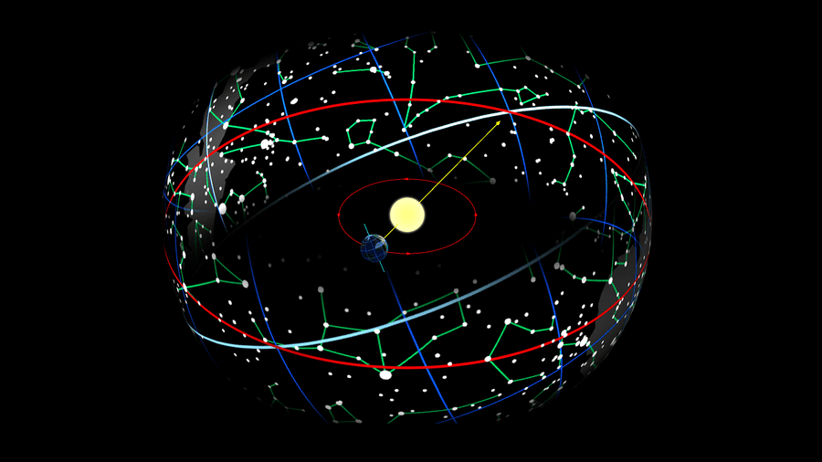
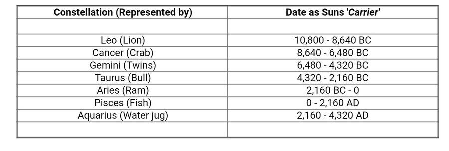
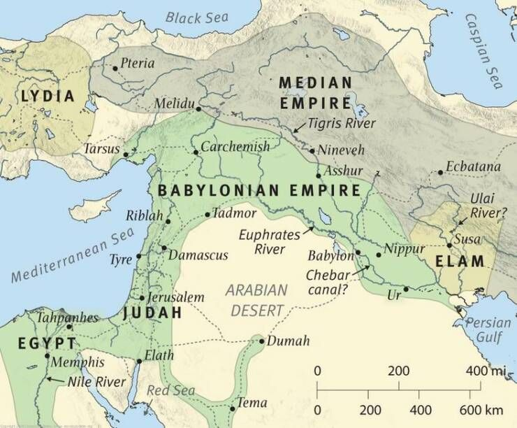
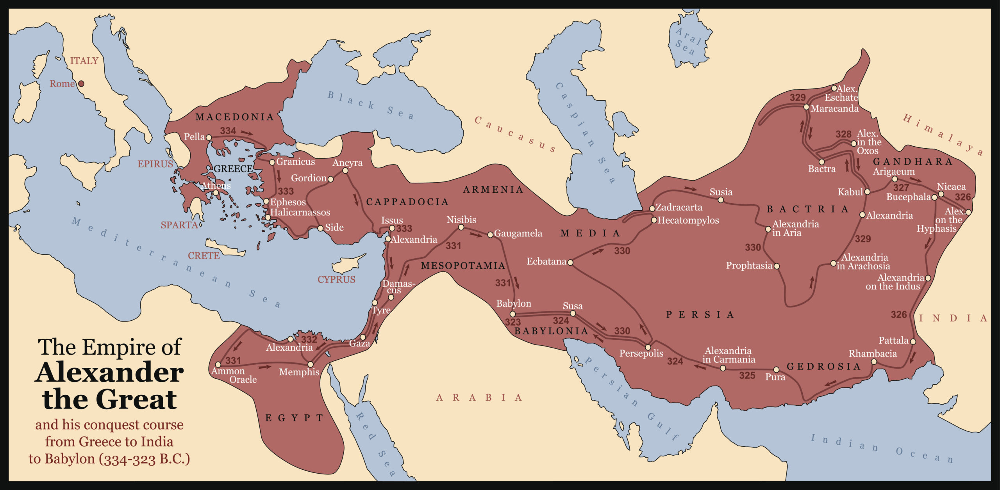
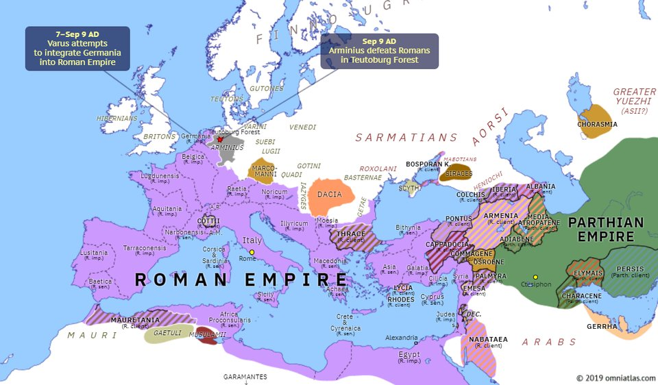
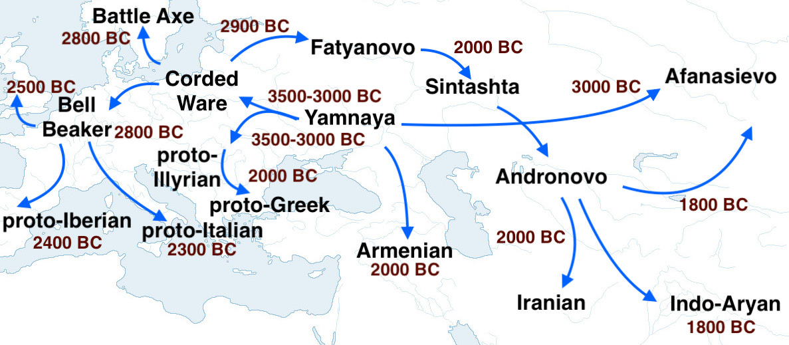
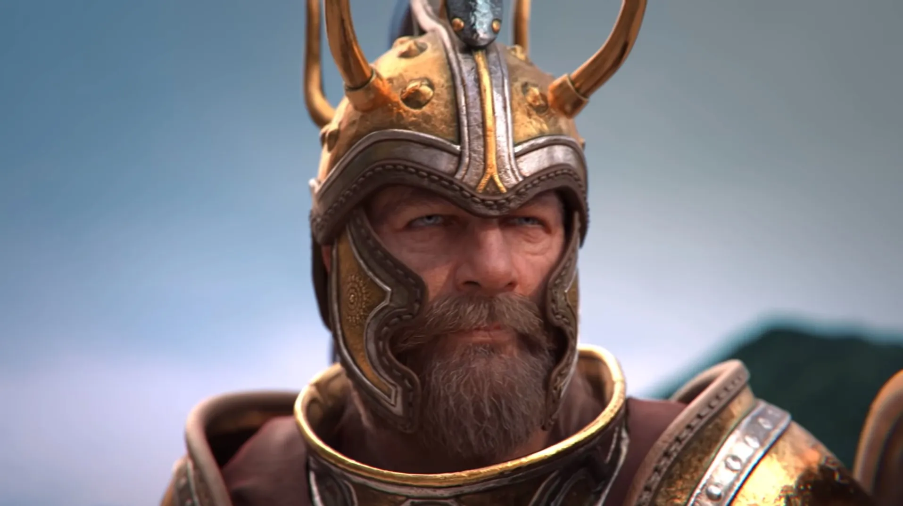
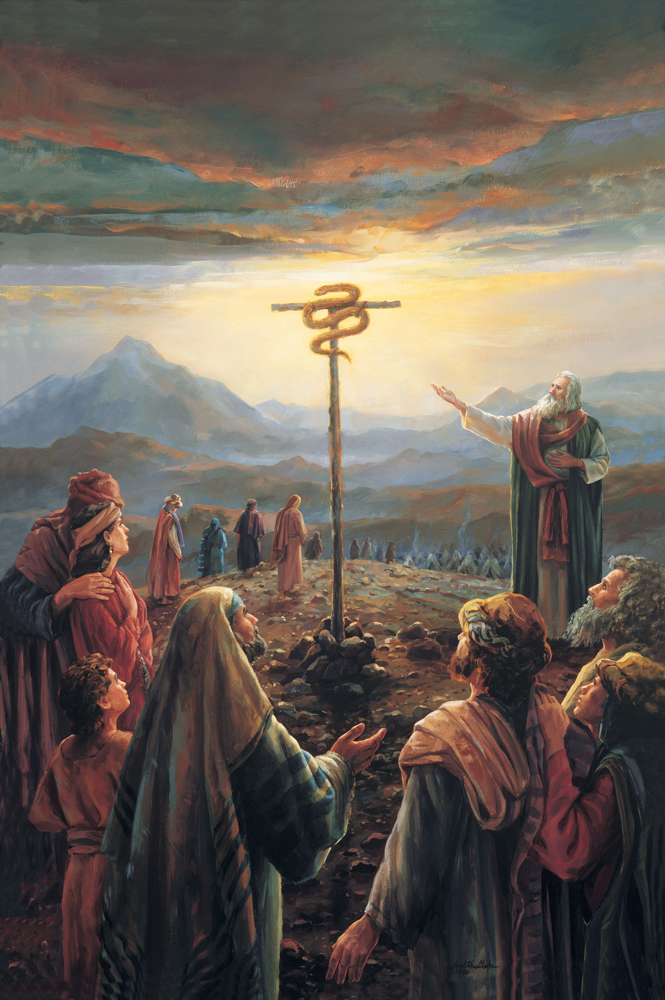
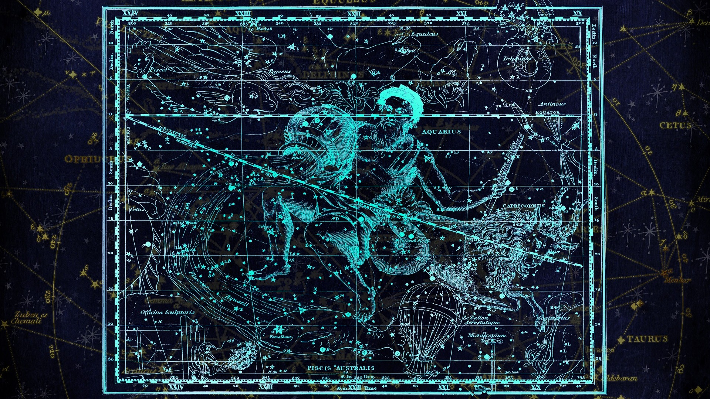

Let's remember the concept of Aions. An Aion is very similar to a Yuga, but derived from Hellennic and IE astrology and the procession of the equinox rather than a division of the eternal cycle into four descending sections. The movement of the Earth's axis over time causes the constellations to drift slowly with respect to the Earth, specifically the spring horizon. When Hipparchus discovered this c. 150 BC, the spring equinox sun sat in front of Aries; by 1000 AD, it sat well in front of Pisces. And so the very stars themselves change precedence over us. Choosing the spring equinox was somewhat arbitrary, but choose any astronomical point and the stars behind it will drift. Since the stars hold gentle influence over our lives, our minds, and our stories, the changing of the stars also changes the nature of the world itself. See [this book](https://x.com/ogmios/status/1392592990393229317) for a breakdown of ancient star-wisdom.

This point cannot be overstated: different aions have different rulers, just as the stars do. One aion will not be the same as any other. What is Right and Good in one, will be Boring, Tired, Ineffective in another. We can even say that they have different rules. Another point about the astronomy of this: many people divide the sky into twelve *equal* sections, instead of dividing then based on where the constellations end. Any Astrology based on math rather than naked-eye observations is inferior, speaking anthropologically. Research Tropical vs Sidereal systems.

Let's start with one we all know. When the stars of Aries were presiding, the world was led by the Aries archetype. This aion stretched from roughly 2000 BC to 0 AD. During this time the Ram, not the Bull or the Fishes, was the primary world archetype. The Ram meant that the actions of all the people of the world were characterized by pushing, creating boundaries, and challenging. Force itself was king. See the [hidden meaning of the Celtic Ram](https://x.com/ogmios/status/1402068975740243969). And what major events did the world see during the reign of the Ram? The first division of the world into empires. And the two crowning achievements of the Age, Alexander's Empire and Rome's Empire.

In those days, it paid to be expansionist and violent. The primary archetype of that age was Achilles, who noticeably gained no land, but rather paved the way for other diplomats to take the land he conquered. If Achilles was born in 1500AD, his same actions would never work. Because the conditions of society in 1500 AD or 3500 BC were inappropriate for Achilles' warlike nature. The time was not proper for a pure berserker like him. The Ram was the driving force behind the expansion of centralized political states.

Now compare this aion to the Aion of Taurus. The Bull is not forceful like the Ram, but he symbolizes wealth and stable sovereignty. A person with Sun in Taurus prefers to enjoy his winnings and to conquer power centers rather than enforce borders. What could be a major event of the Taurean Age? The Bronze Age Expansions of course, among the proto-Indo-Europeans, the proto-Semites, the Bantus at the very end, etc. Yet, these peoples never established political control as their descendants did in the Arian Age. The lack of central authority allowed the growth on thousands of local city states, as we see most iconically in Sumer and Babylon, but also in, for example, the [Bactria-Margiana Archaeological Complex](https://balkhandshambhala.blogspot.com/2012/10/bactria-land-of-thousand-cities.html), the "land of a thousand cities." Think of Conan the Barbarian as the archetypal Taurean warrior: traversing vast distances to strike down an evil central figure and to take rule of the city. Think of Gilgamesh, who was King of Ur, or Agamemnon, who, in the Arian Age myth, was usurped by the Arian Hero. The contrast throughout the Iliad between Agamemnon and Achilles is the dual energies of the Taurean warrior and the Arian warrior. The one wants to revel in his riches at the expense of honor, and wants the city. The other seeks honor and battle death, not material wealth.

Likewise, there is a Taruean aesthetic in the contruction of forts and religious temples during the Taurean Aion. [Newgrange](https://rgdn.info/en/nyugreyndzh_-_nasledie_druidov), built by the Dagda, who is sometimes literally a bull; the [White Temple of Uruk](https://www.ancient-origins.net/ancient-places-asia/white-temple-and-great-ziggurat-mesopotamian-city-uruk-006835); [Mohenjo Daro](https://pk-photography.blogspot.com/2011/06/mohenjo-daro.html); singular, glorious temples and cities. Let's compare these to art and artifacts of the Arian Age: pottery, below from 1300 BC, horses and war chariots; the [Treasury of Atreus](https://www.thearchaeologist.org/blog/treasury-of-atreus-the-monumental-mycenaean-tomb), Mycenae; most steppe and early European [burial mounds](https://minervamagazine.com/treasures-of-the-scythian-kings.html) were formed in this aion, richly adorned and scattered across the lands.

The movement from Taurus to Aries brought us the [Mithraic Tauroctony](http://www.mysterium.com/eighthgate.html) (notice: the Zodiac above Mithras). The transition caused Moses to reject the Golden Cow (notice: gold, wealth, Taurean symbols) in favor of the forceful God of Fire. A Mosaic Tauroctony.

<figcaption>Moses and the Brass Serpent by Judith Mehr</figcaption>

Let's go back further. Before Taurus the world was in Gemini, approx. 6,000 - 4,000 BC. We have little to no direct mythical evidence of the Geminian Age, except for echoes in myths written in later Ages, but archaeology has given us a solid idea of what the world was like then. Most of Europe was settled by Anatolian Farmers within this Aion. This was when Mercury/Lugh/Wotan taught our ancestors farming, craft skills, and writing. The [Vinča Script](http://www.prehistory.it/ftp/inventory/danube_script/danube_script_01.htm), the world's earliest letters, dates from about 5000 BC. Gemini is ruled by the planet Mercury, and the Twins of Gemini reflect this. The Twins are an echo of a myth which was surely the dominant world-archetype in the Geminian Aion. They are Castor and Pollux to the Greeks. Pollux was the soul of Castor, both sons of Zeus and of Tyndareus of Sparta (or in other versions, one was the son of immortal Zeus and the other of mortal Tyndareus). In Babylon, the Twins are Meshlamtaea and Lugalirra (Lugh?), which mean "One who has arisen from the Underworld" (Otherworld?) and "Mighty King". That is, one is "dead" or a spirit, and one is a King or at least royalty. Both are associated with a god of sickness and health. We can therefore expect that the Geminian Aion is that era in which Man first discovered his soul as separate from his own being, or his Self as separate from his Ego. One dies, one never dies. One can be King, one is only a spirit.

What does it mean that Man's soul first became separate from himself? Man first became self-aware at this time. He started on the path of becoming an individual rather than an extension of the tribe. It was the birth of consciousness, hence why the Bible dates Genesis to this time. Before that time, in the Cancerian Aion specifically, Man was merely a finger of the tribal hand, an appendage of the racial arm. By developing his conscious mind, as opposed to his collective, unconscious mind, he began writing, planning for agriculture, trading, and thinking. And the trade of ideas between peoples and within the mind was mirrored by trading routes between the first cities. Communication as well. The cities of [Eridu](https://www.vision.org/de/node/161), Aleppo, [Argos](https://books.google.com/books?id=TSLeX0GRNqwC&q=121#v=onepage&q=7%2C000%20years%20of%20a%20settled%20community&f=false) (which introduced standard weights to Greece), and Athens were first inhabited under the stars of Gemini. The myth of the birth of the Dioscuri is arguably a myth of the transition from Gemini to Taurus, as the Taurean God Zeus eventually sent the Twins to live in the stars. One of Athens' most ancient temples is dedicated to the Dioscuri.

The Cancerian Aion, c. 8,000 - 6,000 BC, the time of the Great Mother, in which Man first began to coagulate into permanent villages. The Mother archetype which ruled this Aion was what inspired man to form homes and establish family life. As we go back further, we have fewer and fewer myths, as well as far less material evidence. I can't point to a single anti-Mother myth which signals the end of Cancer and the beginning of Gemini, but the archetype is certainly there. Gaia's sons, Rhea's sons, etc. The most appropriate, perhaps, is Leto, who birthed the divine siblings Artemis and Apollo. Quite literally a mythic mother figure giving way to her two divine children. The state of the world in the Cancerian Aion was the first major step away from nomadic hunting and gathering. Many peoples supplemented their game with crops, and build solid houses for the first time. (Structures are dated prior this age, but they increased their range here). I want to emphasize: we have an aversion to "The Feminine" now which is unfounded. There is a time and a place for feminine energy, just like all things, and in the Cancerian Aion "feminine" actions would make you powerful. Actions like building a house and defending it. The question is whether we need feminine energy today, or masculine. And the answer is both and neither, we apply them selectively at one time or another. In other words, it's up to you, and the spirit of the age will guide you. The Aion of Cancer was likely also the first time Man consciously discovered the workings of Woman's pregnancy, that it wasn't some supernatural act but that it had a cause and effect. Many other sexual lessons likely emerged in these two thousand years, for both parties.

And earliest, the Aion of Leo, from c. 10,000 BC to 8,000 BC when the Sun rose into the Lion constellation on the spring equinox. Directly succeeding the last glacial maximum, the Aion of Leo was a time of bold leaders and actors, unconcerned with personal loss or homes. A majority of the world was still hunter-gatherers: this was the mythical Golden Age. Man was yet undivided from the tribe, and acted as an extension of the group. For this reason, with the world warming again, each band of men took leaders to roam the world and win what prizes could be won. The lion brings with it the waters of glacial ice melt, which show that through daring and action the world can be enriched. Leo, ruled by the Sun, showed Man to strive for something greater than mere survival. We cannot say much more about this time, because even in archeology the lights are dim. Göbekli Tepe was built in Turkey, and Star Carr was inhabited in Yorkshire. There is a popular perception that people then were less inteligent or capable only of milling about the village's mud houses, but directional social organization was a new phenomenon. Without being constrained by the frozen environment, our ancestors were allowed to take bold actions in a new way.

In roughly 0 AD we passed from Aries into Pisces, this is the transition people still argue over. Our world shifted from a priority of force (which was good in its time) to one of mercy and grace (which is coming to an end soon). This isn't to say that force became unnecessary, remember that we're speaking of the permutations of the soul here, and its fascinations. Jesus showed our ancestors their latent fascination with goodness, purity, and sanctity over dominance. The Two Fishes, as opposed to the Ram, signified the divergence of Good and Evil. The serpent as a symbol was and is hated by Piscean Man, but welcomed as a scion of wisdom by Arian and Taurean Man. Is it any coincidence that the East with Buddhism and the West with Christianity converted to new religions centered on very similar figures, with very similar practices when compared to the Arian paganisms they replaced? The nature of the world was changing. Plenty of symbolism points to the shift from an Aries Aion to a Pisces Aion. Jesus appears as a slain lamb (Ram), for example, one of his christograms is a fish, his apostles are "fishers of men", and his dark counterpart in the figure of Satan, who is the second fish of Pisces. And this should make sense. The Romans had mastered life in the Arian Age, become the best warriors and empire builders. If the world hadn't changed, human life would have stultified under the immortal and bloated Roman Empire. God struck down the serpent which was holding back the waters of change, and the world shifted again. This is his plan for mankind, and Europa specifically, prewritten in the stars and he dislikes when people defy his plan, hence why the reactionary movement to return to an agrarian world which ended centuries ago will fail. The pseudo-reactionary movement to build a new world on top of the wisdom of the old world will succeed. No one can reverse turning of the heavens.

We are moving into into Aquarian Aion, from roughly 2000 AD to 4000 AD. People debate on when it really begins, but I believe it began in the 60s, and the transition period will last until the 2140s. We have both Piscean and Aquarian energy in the world right now. The Age of Aquarius will be characterized by a longing for wisdom, likely caused by a forgetfulness of the past and tradition. Aquarius is the countersign of Leo, and the halfway point around the Great Year of 26,000 years. So I theorize that the next 6 aions will be spent consciously rediscovering all the truths and esoteric sciences which were lost in the past 12,000 years. We will once again understand the body, the mind, and the spirit, and be able to navigate our world in strength and virtue. Aquarius as the countersign of Leo also indicates that everything lacking in the Aion of Leo will occur in overabundance in the Aion of Aquarius. Every sign has their countersign, and also occurs in a fractal nature. Every year the sun travels through these signs; every month, the moon.

Taking this astrological view allows us to understand the triumph of Christianity over paganism. Both are appropriate only for their times. The resurgence of pagan, or "non-Christian" ideas, in our time is the dawning of the Aquarian quest for wisdom.

Fin

