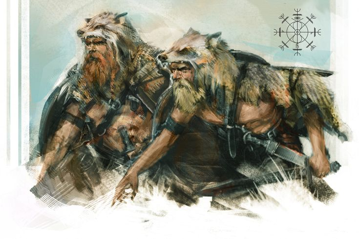
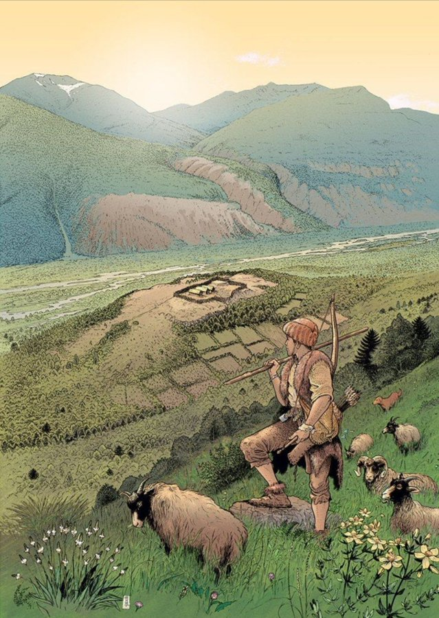

A Hittite law code confirms the Indo-European wolf-warrior tradition of young men leaving society to dress as animals while plundering their neighbors. A discussion on this Hittite source.

The source for today is the essay "The Meaning of the Expression 'To Become a Wolf' in Hittite" by Jos Weitenberg, in the book [Perspectives on Indo-European Language, Culture, and Religion](https://archive.org/details/pearson-ed.-perspectives-on-indo-european-language-culture-and-religion-2-vols.-1991/page/189/mode/1up). The author speaks in academese and tries to avoid drawing any connection to the broader Indo-European world, specifically in reference to the *Koryos* band. This is a warband of young men who were ritualistically cast out from polite society, and sent to the wilderness to hunt animals and raid their neighboring tribes. This went on for some years until the boys became men, after which the men would destroy the rags they had worn as clothes and rejoin society through a ritual and sacrifice, usually at the summer solstice. While in *koryos*, these young men were *not* members of society and did not have legal rights, so no claims could be made for their deaths.

This is why it has intrigued Hittitologists that one law code contains the phrase "You have become a wolf" in a section on murder and abduction, specifically it says that if a man abducts a married woman (with intent to keep her as his own), and if he brings along friends to help in the abduction, and anyone dies in the process, the killer does not have to pay *weregild* for the death. That is to say, the killing is justified and not murder.

>Tak-ku SAL-na-an ku-iš-ki pít-ti-nu-uz-zi nu-ku-i-e-eš a-ap-pa-an-an-da pa-a-an-zi tak-ku LÚ-MEŠ na-aš-ma LÚ-MEŠ ak-kán-zi šar-ni-ik-zi-i NÚ-GÁL zi-ik-wa UR-BAR-RA-as ki-iš-ta-at.

>If anyone abducts a woman and if those who go after, three persons or two persons, are killed there will be no compensation. 'You have become a wolf.'

Clearly no compensation is needed when the killed men were in the act of abducting the man's wife. To pay the abductor's family would be absurd. This is beyond the usual disagreement or honor killing. In fact, these actions which violate law and order are exactly what disqualify the abductor from demanding his legal death-price. His rights become forfeit when he acts against justice. Symbolically, be has cast himself out of justice, like young men in *koryos*.

So the men who abduct a woman may not be ritualistically and permanently cast out of society, but in this instance they are denied their rights due to their feral actions. And so a judge proclaims to them "you have become wolves" to strip them of those rights. We find this expression again in a royal decree of Hattusili I when he disowns his son:

>DUMU-mis NU-DUMU-as. amminzan-a ÌR-MEŠ-amman UR-BAR-RA-as mān pankur-set I-EN ēstu 

>"My son is a non-son. But let him be one of you, my servants, like the kin of the wolf".

So this phrase has become a more general saying, signifying a degradation of rights and standing in society. And we see similar sayings in other Indo-European societies. In Greek one becomes a wolf by eating human remains during a sacrifice, then that person is born a wolf (*λύκοι γενέσθαι*). There is an Old Icelandic oath which unites enemies as relatives, and says that if one breaks the oath, he "will become a wolf and will be persecuted in all places where people hunt wolves."

And in the Frankish Salic Law, banishment is expressed with the phrase "wargus sit" or "let him become a wolf". Even in Old Armenian there is a Christian marriage law tract by Bishop Sewantos which states that premarital relations cause a man to "become a wolf" (gayl ełew). If you look, you can find more examples in each branch of the Indo-European tree. But here in Hittite we find it the oldest, and yet the wolf saying has already become abstracted by their time, showing that the *koryos* war band is older than Hittite by far. Whether a man was part of the tribe, or if he was outcast, was a major consideration in those days. We know from Brehon and Vedic law that the law was something which could only be leveraged by members of the community in good standing in order to resolve conflicts.

Fin

